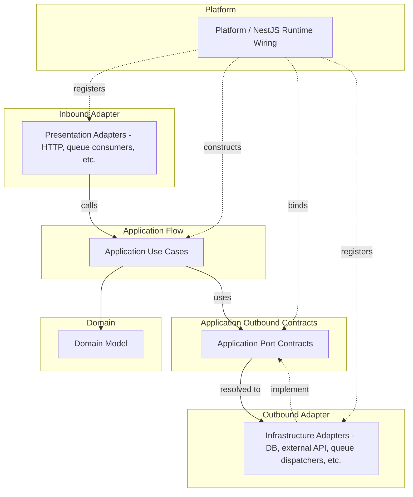

# API Runtime Wiring Convention

## Scope

- Use this document when deciding object creation, provider binding, port implementation registration, NestJS DI
  usage, and runtime configuration ownership.
- Use the [source dependency convention](./source-dependency.md) to decide whether one source file may import another.
- Runtime wiring MUST NOT weaken source dependency rules.

## Runtime Model

### Runtime Flow And Wiring Map

- This map shows runtime flow and provider binding, not source imports.
  - Solid arrows show runtime call or use direction.
  - Dotted arrows show provider registration, binding, or implementation.

## Platform

- Keep `src/main.ts` as a thin process entrypoint.
- `platform` owns application startup and runtime wiring.
  - Use `platform/nest` for NestJS root modules, startup functions, runtime config loading, global filters,
    interceptors, guards, pipes, and app-level provider wiring.
  - `platform` MAY depend on bounded contexts, adapters, kernels, `core`, frameworks, and external runtime libraries.
  - `platform` MUST NOT contain business rules.

## Environment Configuration

- Environment variable definitions belong to the boundary that uses them.
  - The owner SHOULD define the schema, defaults, typed config mapper, and owner-specific validation rules.
- Local API runtime values live in `apps/api/.env`, which MUST NOT be committed.
- `NODE_ENV` describes the Node runtime mode and selects the API app environment (`development`, `production`, `test`).
- Allowed values and defaults for runtime selectors belong in the typed config schema or mapper that owns them.
- `platform` aggregates app-level and selection-level environment schemas.
  - `platform` executes API runtime validation at process startup.
- An adapter's own directory owns the environment variable schema and typed config parser for that adapter.
  - For example, keep a `*.config.ts` file next to the adapter file.
  - The adapter class itself MUST NOT read `ConfigService` or `process.env` directly.
  - The adapter class MUST receive an already-parsed, typed options object through its constructor.
- Runtime wiring that must inspect raw `process.env` SHOULD call owner-provided selector helpers.
  - Conditional module registration is one example.
  - Do not duplicate string comparisons owned by a config boundary.
- Production code SHOULD consume validated typed config providers or `ConfigService` values.
  - Production code should not read `process.env` directly.

## NestJS DI

### DI Boundaries

- NestJS DI MAY be used for runtime wiring in `platform/nest`, presentation adapters, infrastructure adapters, and
  application use cases or services.
- NestJS DI MUST NOT create a source dependency from domain code to NestJS.
- Application use cases and services MAY use narrow constructor-injection metadata.
  - Narrow metadata includes `@Injectable()`, `@Inject()`, and provider tokens.
  - Use cases SHOULD remain constructible as plain TypeScript classes with explicit dependencies.
  - Use case behavior MUST NOT depend on request objects, module references, container lookups, lifecycle callbacks,
    or other NestJS runtime APIs.
- Keep provider registration and module composition in `platform/nest` or bounded context root modules.
  - Bounded context root modules MAY compose that context's application, presentation, and infrastructure providers.
  - Prefer composition by bounded context or runtime boundary instead of creating a module for every use case folder.

### Dynamic Module Composition

- `DynamicModule` factories such as `forRoot()`/`forFeature()` return a new module instance on every call.
  - NestJS does not deduplicate dynamic modules across import paths.
  - If multiple import paths reach the same `forRoot()`, each path instantiates the module and its listeners,
    consumers, and controllers.
- A bounded context root module that exposes `forRoot()` and `forFeature()` MUST separate their responsibilities.
  - Keep event listeners, queue consumers, schedulers, and controllers in `forRoot()` only.
  - Keep only stateless providers that are safe to construct more than once in `forFeature()`.
  - Tokens and repositories are examples of eligible stateless providers.
- Decide whether a provider belongs in `forFeature()` by statelessness, not by current consumer usage.
  - Do not remove a stateless provider because today's only consumer does not need it.
- Let call sites select providers when consumers need different, non-overlapping subsets of `forFeature()`.
  - For example, use `forFeature(tokens)`.
  - Do not continually curate the shared export set around current consumers.
- Import a context's `forRoot()` exactly once from the module that owns its composition.
  - Modules that only need the context's providers MUST import `forFeature()`, not `forRoot()`.

### Adapter Construction

- The module that composes an adapter owns its construction.
  - Read `ConfigService` in the module and call the adapter-owned config parser.
  - Construct the adapter through `useFactory`.
  - Do not inject `ConfigService` into the adapter class.
- A class MUST NOT default a constructor parameter that represents tunable configuration.
  - The module that composes the provider owns the concrete value, including a hardcoded constant.
  - The composing module passes the concrete value explicitly through `useFactory` or a plain constructor call.

### Factory Provider Lifecycle

- An adapter constructed through `useFactory` does not need `@Injectable()`.
  - NestJS still calls lifecycle hooks such as `OnModuleDestroy` on the resulting instance.
- A DI token used only to pass one `useFactory` result to another in the same module MUST remain module-private.
  - Export the token only when another module genuinely needs to inject the same value.
- Parsing an adapter's config and constructing the adapter MAY happen in a single `useFactory`.
- Split config parsing and construction only when the container must track the adapter instance separately.
  - Split them when an adapter implements a lifecycle hook but the exported token exposes only a derived value.
  - Without a provider for the adapter instance, NestJS cannot call the instance's lifecycle hook.

## Port Binding

- A port is an application-owned boundary contract, not any interface, error type, DTO, mapper, or shared contract.
- Follow the [infrastructure convention](./infrastructure.md) for contract file and type naming.
- Runtime wiring MAY connect an outer implementation to an inner port without reversing source dependencies.
  - Infrastructure adapters may implement application ports.
  - `platform` or bounded context wiring registers the implementation for each port.
- Do not use runtime wiring as a reason to add forbidden imports to domain or application core.

## Non-Port Contracts

- Do not classify every boundary type as a port.
  - Presentation DTOs, mappers, and failure responses are protocol adapter contracts.
  - Infrastructure exceptions and persistence mappers are adapter concerns.
- If application core must consume an outer-layer contract, move the contract inward.
  - Model it as an application port or application-kernel contract.
