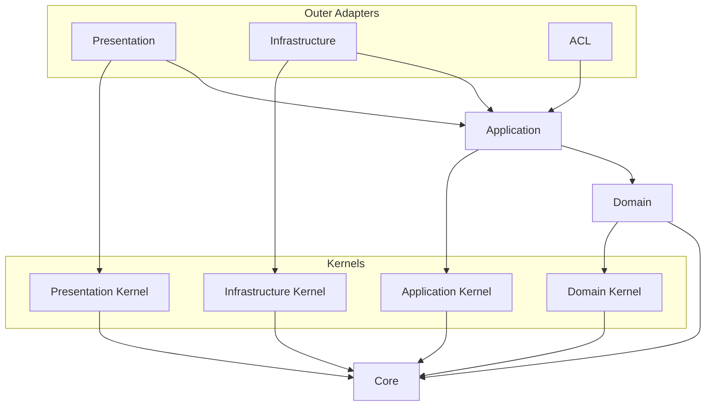

# API Source Dependency Convention

## Scope

- Use this document when deciding import direction, source layer ownership, project path aliases, and public surfaces.
- Use the [runtime wiring convention](./runtime-wiring.md) when deciding how implementations are created or bound.
- Dependency direction MUST remain consistent from outer layers toward inner layers.

## Dependency Direction

### Visual Dependency Map

- Read every arrow as "the source may import the target."
  - Treat dependencies not shown or explicitly allowed by a routed convention as forbidden by default.

- `acl` also depends on another bounded context's public surface (`@contexts/<other-context>`) — not shown above, since
  this diagram maps dependencies within one context. Follow the
  [context integration convention](./context-integration.md) for that cross-context edge.

## Import Surfaces

### Import Path Policy

- Project path aliases are declared only in [`apps/api/tsconfig.json`](../../../tsconfig.json).
- TypeScript, Vitest, and static analysis tools should consume `tsconfig.json`.
  - Do not redefine project alias meaning in each tool.
- Path aliases represent stable architectural boundaries, not general path-shortening conveniences.
  - Keep aliases limited to named source boundaries such as `@core/*`, `@kernels/*`, `@contexts/*`, and
    `@platform/*`.
  - Do not add broad aliases such as `@api/*`, `@src/*`, or `@/*`.
- Use a source-boundary alias when production code crosses a boundary for which an alias exists.
  - Prefer relative imports inside the same local implementation area.

### Public Surface Policy

- Use `index.ts` as the public surface for intentionally exported contracts, not as default folder decoration.
  - Do not create `index.ts` mechanically or re-export every folder-internal export.
- Public surfaces should expose only contracts that another source area actually needs to import.
  - Do not expose internal implementations, helpers, adapter details, test fixtures, or local-only types unless they
    are external contracts.
- Cross-boundary imports SHOULD target a public surface when one exists.
  - Production imports into kernels, context domain code, and application ports should use their public surfaces.
- Avoid deep imports into another context or layer internals unless a routed convention explicitly allows them.
  - Follow the [context integration convention](./context-integration.md) for cross-context adapter and wiring imports.

## Source Areas

### Core

- `core` contains pure primitives that have no layer, framework, bounded context, or business vocabulary.
- Any layer MAY depend on `core`.
- `core` MUST NOT depend on project layers, frameworks, external SDKs, or business concepts.

### Domain Layer

- The domain layer owns business rules and domain models.
  - Follow the [DDD convention](./ddd.md) for domain model ownership and building blocks.
- Domain code MAY depend on `core` and `kernels/domain`.
- Domain code MUST NOT depend on application, infrastructure, presentation, platform, framework, database, HTTP, or
  SDK code.

### Application Layer

- The application layer owns use cases and application flow.
- Application code MAY depend on `core`, domain code, `kernels/application`, and same-context `*.di-tokens.ts` files.
- Application code MAY use narrow NestJS DI APIs only when they describe object construction.
  - Provider decorators and injection tokens are allowed.
  - Keep dependencies explicit in constructors so use cases remain constructible as plain TypeScript classes.
- Application behavior MUST NOT depend on infrastructure implementations, presentation DTOs, platform concrete types,
  module configuration, container lookups, or framework lifecycle callbacks.
- Application code SHOULD propagate domain, infrastructure, and system exceptions unless it can recover or add
  application-owned context.
  - Follow the [error policy](../operability/error.md) for exception ownership and transformation.

### Infrastructure Layer

- Infrastructure is the outbound (driven) adapter layer.
  - It implements application-owned ports or domain/application contracts to reach concrete technology.
  - Follow the [infrastructure convention](./infrastructure.md) for adapter naming and structure.
- Infrastructure code MAY depend on `core`, domain, application, `kernels/infrastructure`, frameworks, and external
  libraries when implementing adapters.
- Infrastructure code MUST NOT depend on presentation or platform startup code.
- Adapter code MAY wrap technology-specific errors in an `Error` with `cause` when adding adapter context.
  - Follow the [error policy](../operability/error.md) for error ownership and transformation.

### Anti-Corruption Layer (ACL)

- The ACL implements a consumer-owned port to reach across a bounded context boundary.
  - Follow the [context integration convention](./context-integration.md) for adapter naming, file location, and
    the producer/consumer naming vocabulary.
- ACL code MAY depend on `core`, this context's own `application/ports`, and another context's public surface
  (`@contexts/<other-context>`, i.e. that context's `index.ts`).
- ACL code MUST NOT depend on this context's own domain or infrastructure internals, presentation, or platform.
- ACL code MUST NOT depend on another context's domain, infrastructure, presentation, or root-level wiring files —
  only that context's `index.ts` public surface.

### Presentation Layer

- Presentation is the inbound (driving) adapter layer.
  - It receives external triggers and calls application use cases without an application-owned port.
- Presentation code MAY depend on `core`, application, `kernels/presentation`, frameworks, and protocol libraries.
- Presentation code MUST NOT depend on infrastructure implementations, database adapters, or SDK adapters.
- Presentation includes protocol-facing entry points and non-protocol inbound triggers.
  - Protocol-facing entry points include HTTP controllers, GraphQL resolvers, DTOs, protocol mappers, and HTTP error
    mappers.
  - Non-protocol inbound triggers include queue/message consumers and scheduled job triggers.
  - Classify by whether the adapter initiates an application call, not by whether it handles HTTP.
- Protocol-facing presentation code converts protocol exceptions into responses and applies masking policy.
  - Non-protocol triggers have no protocol response to shape.
  - Follow the [error policy](../operability/error.md) for masking and exception transformation.

### Technology-Coupled Adapter Classification

- Classify a technology-coupled adapter by direction, not by the technology it uses.
  - An adapter that initiates an application call is driving and belongs to presentation.
  - An adapter that implements an application-owned port is driven and belongs to infrastructure.
  - A queue consumer is presentation; a queue dispatcher or producer is infrastructure.
- The same technology may appear on both sides of a feature because each direction has a different responsibility.

### Wiring Areas

- A bounded context root wiring module MAY import that context's application, presentation, infrastructure, and
  ACL code.
  - It MUST NOT arbitrarily compose another context's internal implementation.
- `platform` MAY import bounded contexts, adapters, kernels, `core`, frameworks, and external runtime libraries for
  startup and module wiring.
  - Production code outside `platform` MUST NOT import `platform`, except the thin `src/main.ts` entrypoint.

### Kernel Directory

- Kernel directories MAY depend on `core`.
- Kernel directories MUST NOT depend on bounded contexts, platform, frameworks, or outer layers.
- Keep feature-specific policy inside its owning bounded context.
  - Kernel directories MUST NOT become generic utility buckets.

### Event Emitter Exceptions

- Domain code and `kernels/domain` MAY depend on Node.js's built-in `EventEmitter` as an explicit exception.
  - This exception does not include framework event emitters.
- Application code MAY depend on `@nestjs/event-emitter` only to publish or handle application and domain events.
  - This exception does not permit unrelated NestJS runtime dependencies in application code.
