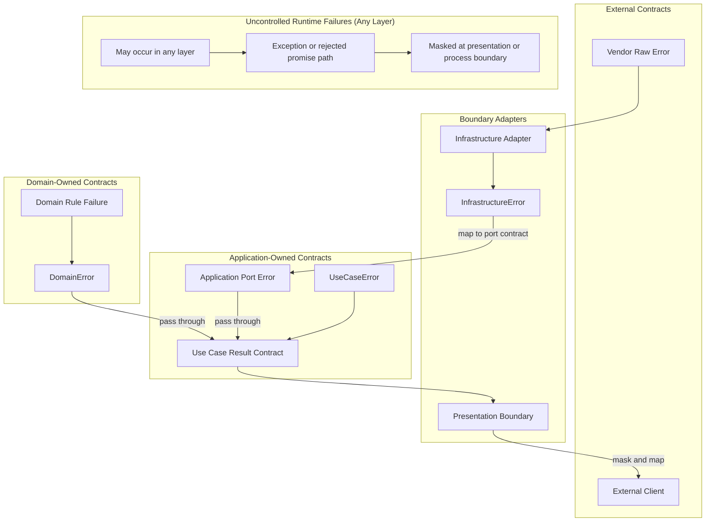

# API Error Policy

Errors are part of the API's control flow and contracts.

## Scope

- Use this document when deciding what a failure means, who owns it, when it is transformed, and what information it may expose.
- This policy covers application-controlled errors, vendor raw errors, unexpected system errors, and protocol-facing error responses.

## Failure Ownership

### Controlled And Uncontrolled Failures

First decide whether the application owns the failure as a contract.
This project separates application-controlled errors from failures the application cannot reasonably control.

- Application-controlled errors are expected failure values owned by application code or a boundary. Use error naming such as `DomainError`, `ApplicationError`, and `InfrastructureError`.
- Vendor raw errors are external adapter, SDK, database, HTTP client, or framework failures before the application translates them.
- System errors are unexpected runtime, process, network, OS, resource, or environment failures that cannot be handled as a normal application contract.
- Logging MAY support observability, but logging alone is not failure handling.

### Controlled Error Owners

Classify application-controlled errors by the boundary that owns their meaning:

- Domain errors: business rule failures and domain invariant violations.
- Application errors: use case, orchestration, and application-owned contract failures.
- Infrastructure errors: technical adapter failures translated into an application-controlled shape.
- Presentation errors: protocol-facing failure responses, such as HTTP, GraphQL, or request validation failures.

### Result And Exception Channels

- Use `Result` for expected failures that are intentionally part of an application-controlled contract, such as caller-correctable validation failures, business rule failures, and value object factory failures that callers should branch on.
- Use thrown exceptions or rejected promises for unexpected technical, operational, or programming failures that are not useful caller-facing contracts.
- Domain constructors guard internal invariants by throwing. This includes entity and aggregate base invariants such as invalid identifiers or invalid props, and value object invariants reached through direct constructors.
- Entity, aggregate, and value object factory methods may still return `Result` for value-level domain failures they explicitly compose, but constructor guard failures stay on the exception channel.
- Treat thrown invariant failures from a constructor as a bug, corrupted persisted state, or insufficient boundary validation unless the boundary explicitly translates them into a controlled error contract.

## Transformation Boundaries

Errors SHOULD be transformed when they cross a boundary where the owner, audience, or contract changes.

- Adapter boundaries translate vendor raw errors into infrastructure or other application-controlled errors when they understand the failure.
- Use cases SHOULD pass through domain errors from the same bounded context unchanged. Use case errors should represent orchestration or application-owned failures.
- Use cases MAY pass through application-owned port errors from the same application boundary unchanged when the port error is already the contract the caller can handle.
- Use cases MAY translate domain errors only when they intentionally own a different caller-facing contract, such as crossing a bounded context or module boundary.
- Protocol boundaries translate application errors into presentation errors or thrown protocol exceptions.
- Independent bounded contexts or modules translate errors through the communication contract used by that boundary.
- Presentation boundaries MUST mask errors, exceptions, and system errors before exposing them to external clients.

Do not wrap errors only because a call stack crosses an internal folder boundary.
Prefer transformation where it improves contract stability, information hiding, ownership, or caller behavior.

## Error Flow

## Error Contract Shape

There is no single correct error shape.
When defining an application-controlled error, prefer this structure unless the owning contract has a reason to differ.

- `kind`: optional stable category for boundary-level handling. Use categories with explicit caller behavior, such as validation failure, dependency unavailability, not found, or state conflict. Do not add catch-all application error kinds for unrecognized system failures.
- `code`: stable value for people and machines to classify the error. Callers SHOULD depend on `code` instead of parsing `message`.
- `message`: human-readable context for debugging, operations, or presentation. It MAY change, be localized, masked, or rewritten. Program code MUST NOT depend on exact `message` text.
- `details`: minimal structured data for caller behavior or machine processing. Because it becomes part of the contract, include only data the receiver may depend on.

Validation errors MAY include field-level details when the caller can act on them.
Do not expose internal diagnostic data through presentation errors unless the protocol contract explicitly allows it.

## Vendor Error Contracts

Vendor raw errors are external contracts.
When adapter code reads structured fields from a vendor error, validate and normalize those fields at the adapter boundary before mapping them to an application-controlled error.

- Prefer `zod` schemas for external error contracts when the adapter depends on structured vendor fields, such as database error codes, constraint names, SDK error codes, or HTTP client response metadata.
- Define external enum-like code sets once as `as const` objects, build the `zod` enum schema from that object, and derive the TypeScript type from the schema with `z.infer`.
- Avoid maintaining a separate TypeScript enum or union and a separate `zod` enum list for the same external code set.
- Allow unknown vendor metadata when the vendor error may include fields the adapter does not own; normalize only the fields the application contract needs.

## Unexpected System Errors

Applications cannot know or handle every possible thrown value or failure.
At boundaries, preserve only the failures the boundary explicitly understands and mask unrecognized failures before exposing them outside the application.

- Convert recognized technical failures into explicit application-controlled categories only when the caller can handle them as part of the contract.
- Keep unrecognized failures on the exception or rejected-promise path until a presentation or process boundary masks them as a safe internal response.
- Preserve the original cause when possible for internal observability.
- Make unrecognized failures observable through logging, metrics, tracing, or another operational signal.
- Do not create silent failures by swallowing unknown failures without handling or observability.

Unexpected system error responses sent outside the application MUST be stable, safe, and masked.
