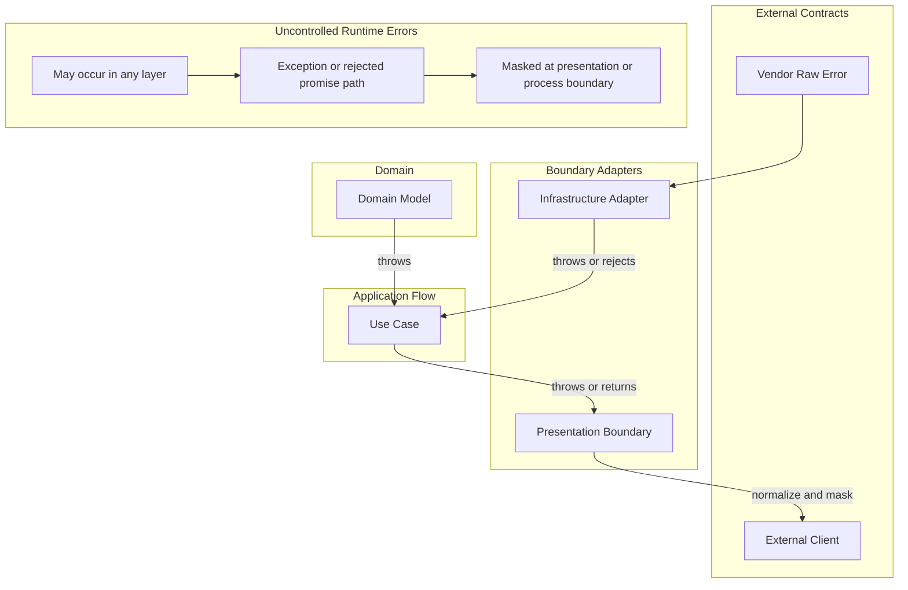

# API Error Policy

Errors are part of API control flow and external contracts.

## Scope

- Use this document when deciding what an error means, who owns it, when it is transformed, and what information it may expose.
- This policy covers thrown exceptions, rejected promises, vendor raw errors, unexpected system errors, and protocol-facing error responses.

## Error Ownership

### Exception And Response Channels

This project uses exceptions as the default error channel.
Use a structured response envelope only at protocol-facing boundaries.

- A thrown error, exception, or rejected promise is interrupted control flow. Use it for domain invariant failures, technical adapter failures, operational failures, and programming errors.
- Request validation is handled at the presentation boundary and may throw a protocol exception with a structured response body.
- A caller should catch an exception only when it can recover, add boundary context, or translate it into a protocol response.
- Application use cases should normally let infrastructure, domain, and system exceptions propagate.
- Do not add `Result`/failure-family contracts by default. Introduce a returned failure contract only when the caller has a stable, useful branching behavior that is clearer than exception propagation.
- Domain constructors and factories guard invariants by throwing. Treat thrown invariant failures as bugs, corrupted persisted state, or insufficient boundary validation unless a boundary explicitly translates them.

### Error Shape Contracts

Structured error shapes are defined as data contracts independent of the channel that carries them.

- Each kernel layer defines its error shapes in `error.base.ts`: `DomainErrorBase`, `ApplicationErrorBase`, `InfrastructureErrorBase`.
- An error shape carries `kind`, `code`, `message`, and `details`. The `kind` classifies the failure; the `code` identifies it stably for callers and machines.
- The same error shape may be carried by an exception channel (`DomainException`, `ApplicationException`) or a result channel (`Result.err(error)`). Choose the channel based on whether the caller needs to branch on the failure, not on the shape of the data.
- Layer-specific exception wrappers (`DomainException`, `ApplicationException`) hold the error shape in their `error` property. Use them when throwing structured errors that a boundary must identify and translate.
- The HTTP presentation boundary maps `ApplicationErrorKind` to HTTP status codes. Domain and infrastructure errors are always masked as `500`.

### Error Owners

Classify errors by the boundary that owns their meaning:

- Domain errors: business invariant and domain model guard failures without transport, database, framework, or SDK details.
- Application errors: use case and orchestration failures that are not owned by a specific external adapter or protocol.
- Infrastructure errors: technical adapter failures, including database, SDK, HTTP client, file system, message broker, and persistence failures.
- Presentation errors: protocol-facing exceptions and response bodies, such as HTTP validation responses.
- Vendor raw errors: external adapter, SDK, database, HTTP client, or framework failures before application code wraps or masks them.
- System errors: unexpected runtime, process, network, OS, resource, or environment failures that cannot be handled as a normal application contract.

Logging may support observability, but logging alone is not error handling.

## Transformation Boundaries

Transform errors when they cross a boundary where the owner, audience, or exposure policy changes.

- Adapter boundaries may wrap vendor raw errors in regular `Error` objects with `cause` when adding adapter context.
- Use cases should not translate infrastructure exceptions only because an infrastructure dependency failed.
- Protocol boundaries translate known protocol exceptions and mask unrecognized exceptions before exposing them to external clients.
- Independent bounded contexts or modules translate errors through the communication contract used by that boundary.
- Presentation boundaries must mask domain, infrastructure, vendor, system, and unknown errors before exposing them to external clients.

Do not wrap errors only because a call stack crosses an internal folder boundary.
Prefer transformation where it improves information hiding, ownership, observability, or caller behavior.

## Error Flow

## Protocol Error Response Shape

Protocol-facing error responses should use a stable envelope.
For HTTP responses, use `HttpErrorEnvelope` from `kernels/presentation` unless the owning protocol has a reason to differ.

- `statusCode`: numeric protocol status.
- `code`: stable value for people and machines to classify the response. Callers should depend on `code` instead of parsing `message`.
- `message`: human-readable context for presentation or debugging. It may change, be localized, masked, or rewritten. Program code must not depend on exact `message` text.
- `details`: minimal structured data for caller behavior or machine processing. Because it becomes part of the response contract, include only data the receiver may depend on.

Validation responses may include field-level details when the caller can act on them.
Do not expose internal diagnostic data through protocol responses unless the protocol contract explicitly allows it.

## Vendor Error Contracts

Vendor raw errors are external contracts.
When adapter code reads structured fields from a vendor error, validate and normalize those fields at the adapter boundary before wrapping or translating the error.

- Prefer `zod` schemas for external error contracts when the adapter depends on structured vendor fields, such as database error codes, constraint names, SDK error codes, or HTTP client response metadata.
- Define external enum-like code sets once as `as const` objects, build the `zod` enum schema from that object, and derive the TypeScript type from the schema with `z.infer`.
- Avoid maintaining a separate TypeScript enum or union and a separate `zod` enum list for the same external code set.
- Allow unknown vendor metadata when the vendor error may include fields the adapter does not own; normalize only the fields the application contract needs.

## Unexpected System Errors

Applications cannot know or handle every possible thrown value or rejected promise.
At boundaries, preserve only the errors the boundary explicitly understands and mask unrecognized errors before exposing them outside the application.

- Convert recognized technical failures into explicit protocol responses only when the external caller can handle them as part of the protocol contract.
- Keep unrecognized failures on the exception or rejected-promise path until a presentation or process boundary masks them as a safe internal response.
- Preserve the original cause when possible for internal observability.
- Make unrecognized failures observable through logging, metrics, tracing, or another operational signal.
- Do not create silent failures by swallowing unknown failures without handling or observability.

Unexpected system error responses sent outside the application must be stable, safe, and masked.
