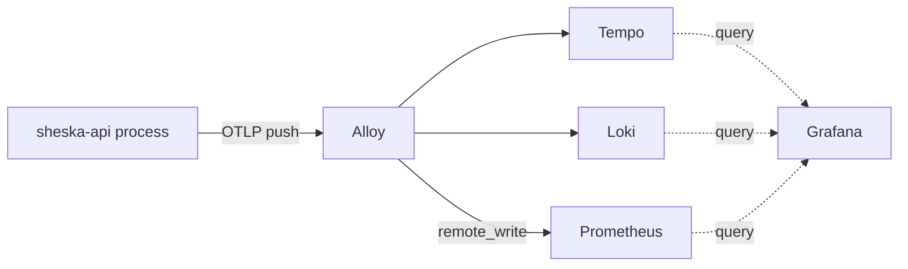

# API Observability Convention

This app pushes traces, logs, and metrics via OpenTelemetry (OTLP) to a cluster-shared collector. This document covers pipeline architecture, transport policy, and ownership boundaries. For deciding whether to log something and at what level, read [API Logging Policy](./logging.md) — that policy governs content and level; this one governs transport.

## Scope

- Use this document when changing OTLP export wiring, environment/endpoint configuration, or the set of resource attributes attached to telemetry.
- The collector, storage, and dashboards (Alloy, Loki, Tempo, Prometheus, Grafana) are owned by the separate `hash-infra` repository, not this one. This repo only owns instrumentation code and the endpoint it points at.

## Pipeline

All three signals push through the same path regardless of environment — there is no local, pull-based fallback:

Metrics are pushed, not scraped, by policy: a pull-based `ServiceMonitor` cannot reach a local dev process behind a VPN, and putting metrics on a different transport than logs/traces would make prod and dev diverge in code rather than in config alone.

`OTEL_EXPORTER_OTLP_ENDPOINT` is the only environment-specific setting — the cluster's in-cluster DNS name in production, the shared stack's VPN-exposed address in local dev. Both point at the same Alloy instance in `hash-infra`.

## Ownership Boundary

`deployment.environment.name` is attached to every signal so Grafana can distinguish production telemetry from local-dev telemetry sharing the same cluster-wide backend.

Neither Loki nor Prometheus promotes OpenTelemetry resource attributes to queryable, indexed labels by default. Each backend requires an explicit opt-in, and that opt-in is owned on the Alloy side in `hash-infra`, not here. Adding a resource attribute in this repo makes it visible in raw payloads but does not make it filterable in Grafana on its own — a matching change in `hash-infra`'s Alloy configuration is also required.

**Caution**: do not enable blanket resource-to-label promotion (Alloy's `resource_to_telemetry_conversion`) for metrics, even though it lives in the other repo. It promotes every resource attribute, including ones that change on every process restart (`process.pid`), turning each restart into a new Prometheus time series that never gets cleaned up.

## Environment Policy

The SDK only starts when `NODE_ENV` is in an explicit allow-list (`production`, `development`) AND `OTEL_EXPORTER_OTLP_ENDPOINT` is set — a whitelist, not an exclusion of `test`, so an unset or unrecognized `NODE_ENV` fails closed instead of leaking telemetry from an unexpected context. Extend the allow-list when a new deployment environment is introduced.

The service name is a hardcoded constant, not an environment variable: an app's own identity is a fact about the codebase, not a per-deployment setting, so it does not belong in `.env.*` files or Helm values the way the OTLP endpoint does.

## Bootstrapping

**Caution**: the OTel bootstrap MUST be the first import in `main.ts`, before every other import, and MUST NOT become a NestJS provider or module. Auto-instrumentation patches modules (`http`, `express`, `pg`, `ioredis`) at `require()` time; anything that loads those modules first — including Nest's own bootstrap sequence — permanently skips instrumentation for them. This is a Node module-loading constraint that applies the same way in any framework, not a NestJS-specific rule.

**Caution**: the bootstrap loads `.env.${NODE_ENV}` directly via `dotenv` instead of through Nest's `ConfigModule`. Do not refactor it to consume `ConfigService` — it runs before `AppModule` loads, so no typed config exists yet at that point.

## Logging Integration

**Caution**: do not add a custom pino `mixin` for trace correlation or a second pino transport for log shipping. `@opentelemetry/instrumentation-pino` already injects `trace_id`/`span_id` into pino output and forwards every log record into the OTel logs pipeline once the SDK is running — adding either again duplicates data and logger configuration.
