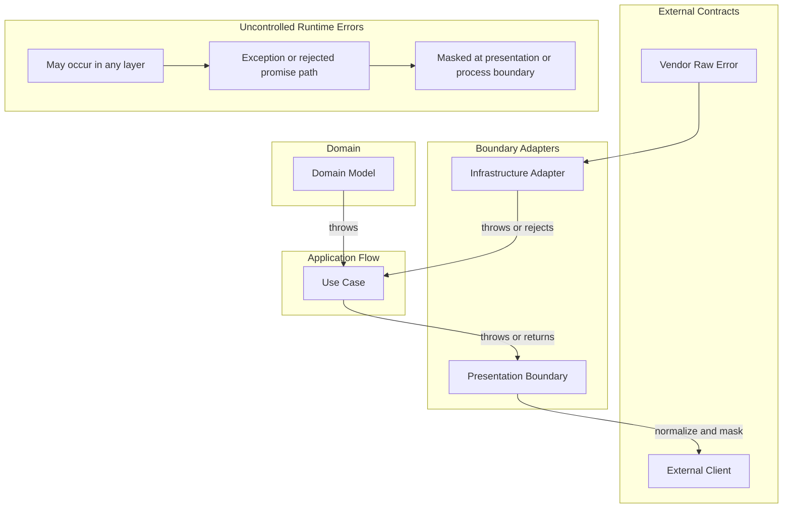

# API Error Policy

## Scope

- Use this document when deciding error meaning, ownership, transformation, and exposure.
- This policy covers exceptions, rejected promises, vendor raw errors, unexpected system errors, and protocol error
  responses.

## Error Ownership

### Exception And Response Channels

- This project uses exceptions as the default error channel.
  - Use thrown errors or rejected promises for domain invariant failures, adapter failures, operational failures, and
    programming errors.
- Use structured failure responses only at protocol-facing boundaries.
  - Presentation request validation may throw a protocol exception with a structured response body.
- Catch an exception only to recover, add boundary context, or translate it into a protocol response.
- Application use cases should normally let infrastructure, domain, and system exceptions propagate.
- Do not add `Result` or failure-family contracts by default.
  - Return a failure contract only when callers have stable, useful branching behavior that is clearer than exception
    propagation.
- Domain constructors and factories guard invariants by throwing.
  - Treat invariant failures as bugs, corrupted persisted state, or insufficient boundary validation unless a
    boundary explicitly translates them.

### Error Shape Contracts

- Define structured error shapes independently of the channel that carries them.
- Each kernel layer defines its error shape in `error.base.ts`.
  - `DomainErrorBase`, `ApplicationErrorBase`, `InfrastructureErrorBase`, and `PresentationErrorBase` are the base
    shapes.
- Every error shape carries `kind`, `code`, `message`, and `details`.
  - `kind` classifies the failure.
  - `code` identifies the failure stably for callers and machines.
  - Infrastructure errors additionally carry `source` and may carry `cause`.
- The same error shape may travel through an exception channel or a result channel.
  - Exception wrappers are `DomainException`, `ApplicationException`, `InfrastructureException`, and
    `PresentationException`.
  - Each wrapper passes `message` to `Error` and exposes `kind`, `code`, and `details` on the exception instance.
  - `InfrastructureException` additionally exposes `source` and preserves `cause` through `Error`.
  - Use an exception wrapper when a boundary must identify and translate a structured error.
  - Use `Result.err(error)` only when the caller needs stable branching behavior.

### Error Owners

- Classify an error by the boundary that owns its meaning.
  - Domain errors represent business invariant and domain model guard failures without technical details.
  - Application errors represent use case and orchestration failures not owned by an adapter or protocol.
  - Infrastructure errors represent technical adapter failures.
  - Presentation errors represent protocol-facing exceptions and response bodies.
  - Vendor raw errors are unnormalized failures from an SDK, database, HTTP client, or framework.
  - System errors are unexpected runtime, process, network, OS, resource, or environment failures.
- Logging supports observability but does not handle an error by itself.
  - Follow the [logging policy](./logging.md) when deciding where and how to log failures.

## Transformation Boundaries

- Transform errors when they cross a boundary where the owner, audience, or exposure policy changes.
  - Do not wrap an error only because the call stack crosses an internal folder boundary.
  - Transform where doing so improves information hiding, ownership, observability, or caller behavior.
- Adapter boundaries may wrap vendor raw errors in `Error` objects with `cause` when adding adapter context.
- Use cases should not translate infrastructure exceptions only because an infrastructure dependency failed.
- Independent bounded contexts translate errors through their communication contract.
  - Follow the [context integration convention](../architecture/context-integration.md) for cross-context boundaries.
- Protocol boundaries translate recognized errors and mask data the external contract does not permit.
  - Map `ApplicationErrorKind` to the protocol status and expose its application-owned error shape.
  - Map recognized `InfrastructureErrorKind` values to protocol statuses but mask infrastructure `details`.
  - Mask domain, vendor raw, system, and unknown errors as a safe internal error response.

## Error Flow

## Protocol Error Response Shape

- Protocol-facing error responses should use a stable failure shape.
  - For HTTP, use `HttpFailure` from `kernels/presentation` unless the protocol has a reason to differ.
  - `statusCode` is the numeric protocol status.
  - `code` is the stable value callers and machines use to classify the response.
  - `message` is human-readable context that may change, be localized, masked, or rewritten.
  - `details` contains minimal structured data on which the receiver may depend.
- Program code MUST NOT parse or depend on exact `message` text.
- Validation responses may include field-level details when the caller can act on them.
- Protocol responses MUST NOT expose internal diagnostics unless the protocol contract explicitly allows them.

## Vendor Error Contracts

- Vendor raw errors are external contracts.
  - Validate and normalize structured vendor fields at the adapter boundary before wrapping or translating the error.
- Prefer a `zod` schema when an adapter depends on structured vendor fields.
  - Examples include database error codes, constraint names, SDK error codes, and HTTP response metadata.
- Define an external enum-like code set once as an `as const` object.
  - Build the `zod` enum from that object and derive the TypeScript type with `z.infer`.
  - Do not maintain a separate TypeScript enum or union and a separate `zod` enum list.
- Allow unknown metadata when a vendor error may contain fields the adapter does not own.
  - Normalize only the fields the application contract needs.

## Unexpected System Errors

- Keep unrecognized failures on the exception or rejected-promise path until a presentation or process boundary.
- Preserve the original cause when possible for internal observability.
- Make unrecognized failures observable through an operational signal.
  - Follow the [logging policy](./logging.md) and [observability convention](./observability.md).
- Do not swallow an unknown failure without handling it or making it observable.
