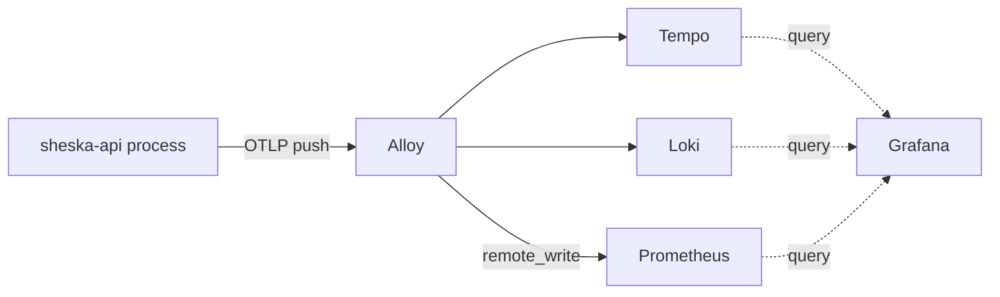

# API Observability Convention

## Scope

- This app pushes traces, logs, and metrics over OTLP to the shared Alloy deployment.
- Use this document for telemetry transport, activation, resource attributes, and ownership.
- Use the [API Logging Policy](./logging.md) to decide what to log and at which level.
  - That policy governs log content and severity; this document governs transport and correlation.

## Pipeline

- All three signals use the same push path in every instrumented environment.
  - There is no local pull-based fallback.

- Push metrics instead of exposing them for a `ServiceMonitor` to scrape.
  - A cluster scraper cannot reach a local development process through the VPN.
  - One transport keeps production and development code paths aligned.
- `OTEL_EXPORTER_OTLP_ENDPOINT` selects the Alloy address.
  - Production uses the in-cluster DNS address.
  - Local development uses the VPN-exposed address of the same Alloy deployment.

## Ownership Boundary

- This repository owns application instrumentation, OTel configuration parsing, and resource attributes.
- The separate `hash-infra` repository owns Alloy, the telemetry backends, dashboards, and endpoint availability.
- Attach these resource attributes to every signal:
  - `service.name`: the hardcoded `SERVICE_NAME` constant.
  - `service.version`: `npm_package_version` from the running package.
  - `deployment.environment.name`: `NODE_ENV`, used to distinguish telemetry sharing one backend.
- Adding a resource attribute does not make it a queryable label in Loki or Prometheus.
  - Label promotion requires an explicit Alloy configuration change in `hash-infra`.
- Do not enable blanket metric resource-to-label promotion with `resource_to_telemetry_conversion`.
  - It also promotes high-cardinality attributes such as `process.pid`.
  - A process restart can then create another persistent Prometheus time series.

## Environment Policy

- Start the SDK only when both conditions are met:
  - `NODE_ENV` is `production` or `development`.
  - `OTEL_EXPORTER_OTLP_ENDPOINT` is present and is a valid URL.
- Leave telemetry disabled for an unset or unrecognized `NODE_ENV`.
  - Extend the allow-list explicitly when introducing another instrumented environment.
- Treat the OTLP endpoint as the only OTel transport value that varies by environment.
- Keep the service name in code, not in `.env.*` files or Helm values.
  - The service name identifies the application and does not vary by deployment.

## Bootstrapping

- The OTel bootstrap MUST remain the first import in `main.ts`.
  - Auto-instrumentation patches modules such as `http`, `express`, `pg`, and `ioredis` as they load.
  - Loading one of those modules first prevents its instrumentation from being applied.
- The bootstrap MUST NOT become a NestJS provider or module.
  - It must run before the NestJS bootstrap and the normal
    [runtime wiring](../architecture/runtime-wiring.md).
- The bootstrap loads `.env.${NODE_ENV}` directly with `dotenv` before parsing its configuration.
  - Do not replace this with `ConfigService`; `AppModule` and typed application config do not exist yet.
- Shut down the SDK on `SIGTERM` so processors can flush pending telemetry.

## Logging Integration

- Do not add a custom pino `mixin` for trace correlation.
  - `@opentelemetry/instrumentation-pino` already injects `trace_id` and `span_id` while the SDK runs.
- Do not add a second pino transport for OTel log export.
  - The same instrumentation already forwards pino records through the OTel logs pipeline.
  - A second integration duplicates records and logger configuration.
