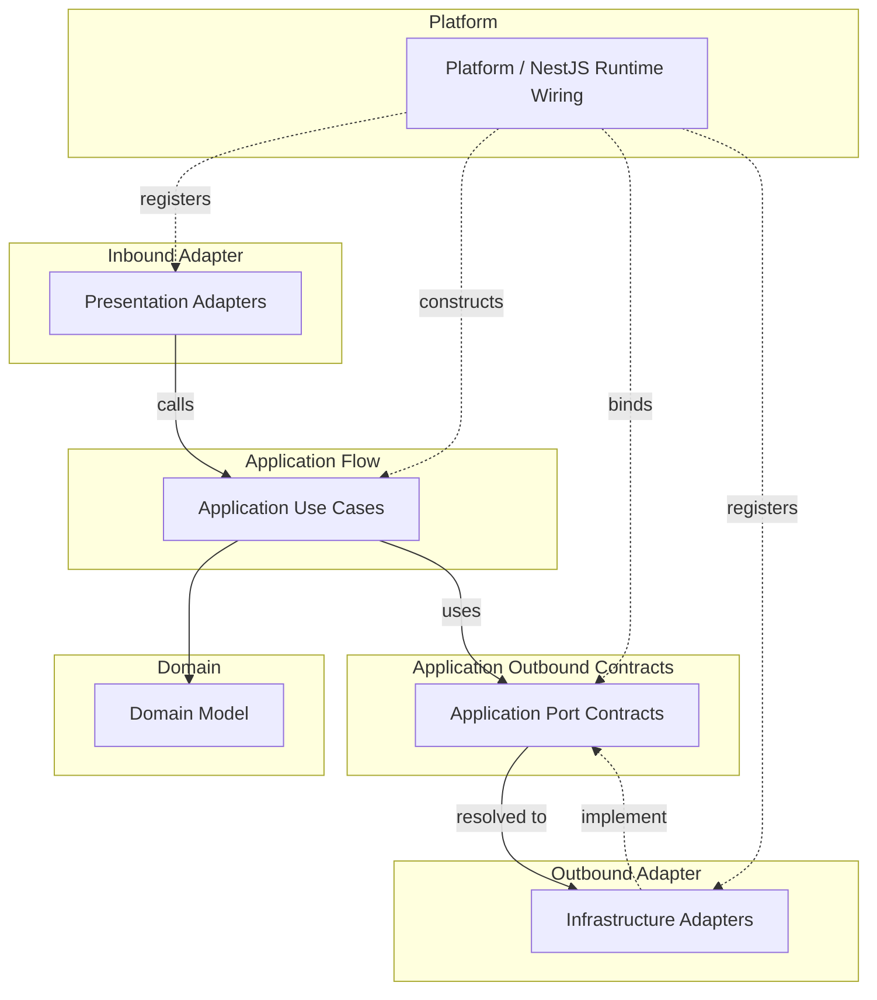

# API Runtime Wiring Convention

Runtime wiring rules decide where objects are created and how implementations are connected to ports.
Runtime wiring MUST NOT weaken source dependency rules.

## Scope

- Use this document when deciding object creation, provider binding, port implementation registration, NestJS DI usage, and runtime configuration ownership.
- Use the source dependency convention when the question is whether one source file may import another.

## Runtime Model

### Runtime Flow And Wiring Map

This map shows runtime flow and provider binding, not source imports.
Solid arrows show runtime call/use direction.
Dotted arrows show provider registration, binding, or implementation.

## Platform

- Keep `src/main.ts` as a thin process entrypoint.
- `platform` contains application startup and runtime wiring code.
- Use `platform/nest` for NestJS root modules, startup functions, runtime config loading, global filters, interceptors, guards, pipes, and app-level provider wiring.
- `platform` MAY depend on bounded contexts, adapters, kernels, `core`, frameworks, and external runtime libraries.
- `platform` MUST NOT contain business rules.
- Production code outside `platform` MUST NOT import `platform`, except the thin `src/main.ts` entrypoint.

## Environment Configuration

- Environment variable definitions belong to the boundary that uses them.
- Local API runtime values live in `apps/api/.env`, which MUST NOT be committed.
- `NODE_ENV` describes the Node runtime mode.
- `APP_ENV` selects the API app environment.
- Allowed values and defaults for runtime selectors belong in the typed config schema or mapper that owns them.
- The owner of an environment variable SHOULD define its schema, defaults, typed config mapper, and owner-specific validation rules.
- `platform` aggregates app-level and selection-level environment schemas and executes API runtime validation at process startup.
- Adapter-specific required environment variables SHOULD be validated by the selected adapter when it creates its typed config.
- Runtime wiring that must inspect raw `process.env`, such as conditional module registration, SHOULD call owner-provided selector helpers instead of duplicating string comparisons.
- Production code SHOULD consume typed config providers or `ConfigService` values after validation, not read `process.env` directly.

## NestJS DI

- NestJS DI MAY be used as runtime wiring in `platform/nest`, presentation adapters, or infrastructure adapters.
- NestJS DI MUST NOT create a source dependency from domain or application core to NestJS.
- Use framework decorators and provider registration in `platform/nest`, presentation adapters, or infrastructure adapters, not in application core.
- Use provider factories or equivalent wiring to create application use cases without adding framework imports to application core.
- Application use cases SHOULD remain plain TypeScript classes constructed from explicit dependencies.
- Bounded context root modules MAY compose that context's application, presentation, and infrastructure providers.
- Prefer composing providers by bounded context or runtime boundary instead of mirroring every use case folder as a NestJS module.

## Port Binding

- In this convention, `port` means an application-owned boundary contract by default.
- A port is not just any interface, error type, DTO, mapper, or shared contract.
- Use `port` as an architecture term and directory concept, but do not add a `Port` suffix to contract type names. Name the contract by the capability it represents.
- Runtime wiring MAY connect outer implementations to inner ports without making the inner source file import the outer implementation.
- Infrastructure adapters may implement application ports.
- `platform` or adapter wiring registers which implementation satisfies each port.
- Do not use runtime wiring as a reason to add forbidden imports to domain or application core.

## Non-Port Contracts

- Domain errors are domain contracts, not ports.
- Application errors are use case contracts, not ports.
- Presentation DTOs and mappers are protocol adapter contracts, not ports.
- Infrastructure error types and persistence mappers are adapter contracts, not ports.
- If an outer layer contract must be consumed by application core, move the contract inward and model it as an application port or application-kernel contract.
