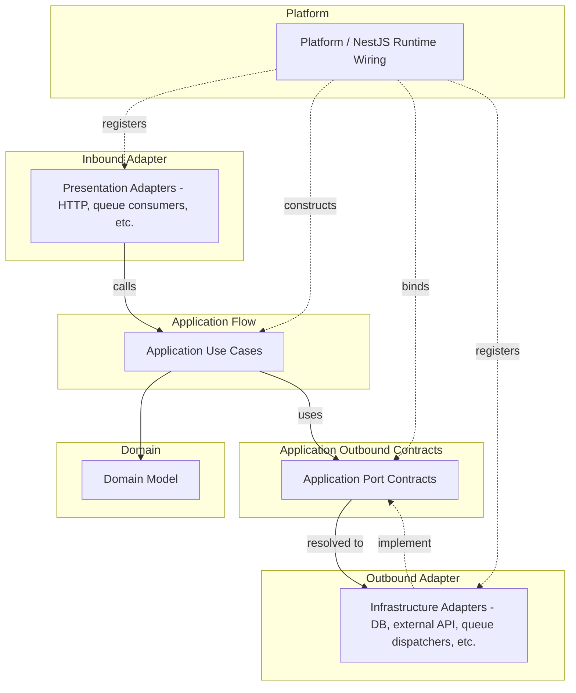

# API Runtime Wiring Convention

Runtime wiring rules decide where objects are created and how implementations are connected to ports.
Runtime wiring MUST NOT weaken source dependency rules.

## Scope

- Use this document when deciding object creation, provider binding, port implementation registration, NestJS DI usage, and runtime configuration ownership.
- Use the source dependency convention when the question is whether one source file may import another.

## Runtime Model

### Runtime Flow And Wiring Map

This map shows runtime flow and provider binding, not source imports.
Solid arrows show runtime call/use direction.
Dotted arrows show provider registration, binding, or implementation.

```mermaid
flowchart TB
  subgraph platform[Platform]
    direction LR
    platformNest[Platform / NestJS Runtime Wiring]
  end

  subgraph inboundRow[Inbound Adapter]
    direction LR
    controllers[Presentation Adapters - HTTP, queue consumers, etc.]
  end

  subgraph usecaseRow[Application Flow]
    direction LR
    usecases[Application Use Cases]
  end

  subgraph contractRow[Application Outbound Contracts]
    direction LR
    ports[Application Port Contracts]
  end

  subgraph outboundRow[Outbound Adapter]
    direction LR
    adapters[Infrastructure Adapters - DB, external API, queue dispatchers, etc.]
  end

  subgraph domainRow[Domain]
    direction LR
    domain[Domain Model]
  end

  platformNest -. registers .-> controllers
  platformNest -. constructs .-> usecases
  platformNest -. binds .-> ports
  platformNest -. registers .-> adapters

  controllers -->|calls| usecases
  usecases --> domain
  usecases -->|uses| ports
  ports -->|resolved to| adapters
  adapters -. implement .-> ports
```

## Platform

- Keep `src/main.ts` as a thin process entrypoint.
- `platform` contains application startup and runtime wiring code.
- Use `platform/nest` for NestJS root modules, startup functions, runtime config loading, global filters, interceptors, guards, pipes, and app-level provider wiring.
- `platform` MAY depend on bounded contexts, adapters, kernels, `core`, frameworks, and external runtime libraries.
- `platform` MUST NOT contain business rules.
- Production code outside `platform` MUST NOT import `platform`, except the thin `src/main.ts` entrypoint.

## Environment Configuration

- Environment variable definitions belong to the boundary that uses them.
- Local API runtime values live in `apps/api/.env`, which MUST NOT be committed.
- `NODE_ENV` describes the Node runtime mode and selects the API app environment (`development`, `production`, `test`).
- Allowed values and defaults for runtime selectors belong in the typed config schema or mapper that owns them.
- The owner of an environment variable SHOULD define its schema, defaults, typed config mapper, and owner-specific validation rules.
- `platform` aggregates app-level and selection-level environment schemas and executes API runtime validation at process startup.
- An adapter's own directory owns the environment variable schema and typed config parser for that adapter (for example, a `*.config.ts` file next to the adapter file). The adapter class itself MUST NOT read `ConfigService` or `process.env` directly — it MUST receive an already-parsed, typed options object through its constructor.
- Runtime wiring that must inspect raw `process.env`, such as conditional module registration, SHOULD call owner-provided selector helpers instead of duplicating string comparisons.
- Production code SHOULD consume typed config providers or `ConfigService` values after validation, not read `process.env` directly.

## NestJS DI

- NestJS DI MAY be used pragmatically as runtime wiring in `platform/nest`, presentation adapters, infrastructure adapters, and application use cases or services.
- NestJS DI MUST NOT create a source dependency from domain code to NestJS.
- Application use cases and services MAY use narrow DI metadata such as `@Injectable()`, `@Inject()`, and provider tokens for constructor injection.
- Keep provider registration and module composition in `platform/nest` or bounded context root modules instead of scattering module wiring through application code.
- Application use cases SHOULD remain instantiable as plain TypeScript classes constructed from explicit dependencies.
- Do not make use case behavior depend on NestJS request objects, module references, container lookups, lifecycle callbacks, or other framework runtime APIs.
- Bounded context root modules MAY compose that context's application, presentation, and infrastructure providers.
- Prefer composing providers by bounded context or runtime boundary instead of mirroring every use case folder as a NestJS module.
- `DynamicModule` factories such as `forRoot()`/`forFeature()` return a new module instance on every call. NestJS does not deduplicate them across import paths, so an import graph that reaches the same `forRoot()` from more than one path instantiates that module, and every listener, consumer, and controller it registers, once per path.
- A bounded context root module that exposes both `forRoot()` and `forFeature()` MUST keep event listeners, queue consumers, schedulers, and controllers in `forRoot()` only.
- `forFeature()` MUST contain only stateless providers, such as tokens and repositories, that are safe to construct more than once.
- A provider's eligibility for `forFeature()` is decided by statelessness alone, not by whether a current external consumer uses it. Do not move a stateless provider out of `forFeature()` just because today's only consumer does not need it.
- If `forFeature()`'s export surface grows costly because different consumers need different, non-overlapping subsets of it, address that by having the call site select providers explicitly (for example, `forFeature(tokens)`), not by continuing to manually curate which stateless providers stay in or out.
- Import a context's `forRoot()` exactly once, from the module that owns the composition. Other modules that only need that context's providers MUST import `forFeature()`, not `forRoot()`.
- The module that composes an adapter reads `ConfigService`, calls that adapter's own config parser, and constructs the adapter through `useFactory`. Do not inject `ConfigService` into the adapter class itself.
- This composition ownership is not limited to adapters or `ConfigService`-sourced values. A class MUST NOT default a constructor parameter that represents tunable configuration; the module that composes the provider owns the concrete value — including a hardcoded constant — and passes it explicitly through `useFactory` or a plain constructor call.
- An adapter constructed through `useFactory` does not need `@Injectable()`; NestJS still calls lifecycle hooks such as `OnModuleDestroy` on the resulting instance.
- A DI token created only to pass one `useFactory`'s output into another `useFactory` within the same module MUST stay module-private (not exported) unless a different module genuinely needs to inject that same value.
- Parsing an adapter's config and constructing the adapter MAY happen in a single `useFactory`. Split them into a separate options provider and a construction provider only when something else in the container needs the adapter instance itself tracked separately — for example, the adapter implements a lifecycle hook such as `OnModuleDestroy` and the token that's actually exported only exposes a derived value (not the instance), so NestJS would otherwise never see the instance to call the hook on it.

## Port Binding

- In this convention, `port` means an application-owned boundary contract by default.
- A port is not just any interface, error type, DTO, mapper, or shared contract.
- Use `port` as an architecture term and directory concept, but do not add a `Port` suffix to contract type names. Name the contract by the capability it represents.
- Runtime wiring MAY connect outer implementations to inner ports without making the inner source file import the outer implementation.
- Infrastructure adapters may implement application ports.
- `platform` or adapter wiring registers which implementation satisfies each port.
- Do not use runtime wiring as a reason to add forbidden imports to domain or application core.

## Non-Port Contracts

- Presentation DTOs and mappers are protocol adapter contracts, not ports.
- Presentation failure responses are protocol adapter contracts, not ports.
- Infrastructure exceptions and persistence mappers are adapter concerns, not ports.
- If an outer layer contract must be consumed by application core, move the contract inward and model it as an application port or application-kernel contract.
