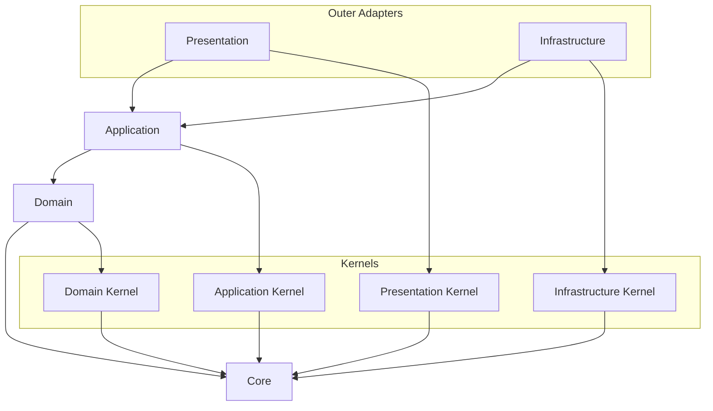

# API Source Dependency Convention

Source dependency rules decide what a source file may import.
Dependency direction MUST remain consistent from outer layers toward inner layers.

## Scope

- Use this document when deciding import direction, source layer ownership, project path aliases, and public surfaces.
- Use the runtime wiring convention when the question is how implementations are created or bound at runtime.

## Dependency Direction

### Visual Dependency Map

Read every arrow as "the source may import the target."
If a dependency is not shown here and is not explicitly allowed in this document, treat it as forbidden by default.



The primary source direction is:

```text
presentation -> application -> domain -> core
infrastructure -> application -> domain -> core
```

### Source Direction

Judge source dependencies by the boundaries each source area may import and must not import.

| Source area | May import | Must not import |
| --- | --- | --- |
| `core` | Nothing | project layers, frameworks, external SDKs, and business concepts |
| `kernels` | `core` | bounded context implementations, `platform`, framework code, and outer layers |
| `domain` | `core`, `kernels/domain` | `application`, `infrastructure`, `presentation`, `platform`, NestJS, database, HTTP, and SDK code |
| `application` | `core`, `domain`, `kernels/application` | infrastructure implementations, presentation DTOs, framework decorators, framework DI APIs, and platform concrete types |
| `infrastructure` | `core`, `domain`, `application`, `kernels/infrastructure`, frameworks, or external libraries when implementing adapters | `presentation` and `platform` startup code |
| `presentation` | `core`, `application`, `kernels/presentation`, frameworks, or protocol libraries when handling external protocols | infrastructure implementations, database adapters, and SDK adapters |
| Bounded context root wiring module | that context's application, presentation, and infrastructure code to compose the feature | arbitrary composition of another context's internal implementation |

`platform` may import bounded context, adapter, and framework code required for runtime startup and module wiring.
Production code outside `platform` must not import `platform`, except the thin `src/main.ts` entrypoint.

## Import Surfaces

### Import Path Policy

- Project path aliases are declared only in [`apps/api/tsconfig.json`](../../tsconfig.json).
- TypeScript, Vitest, and static analysis tools should consume `tsconfig.json` instead of redefining project alias meaning.
- Path aliases represent stable architectural boundaries, not general path-shortening conveniences.
- Keep aliases limited to named source boundaries such as `@core/*`, `@kernels/*`, `@contexts/*`, and `@platform/*`.
- Do not add broad aliases such as `@api/*`, `@src/*`, or `@/*`.
- When aliases exist for source boundaries, production `src` imports should use them when crossing those boundaries.
- Prefer relative imports inside the same local implementation area.

### Public Surface Policy

- `index.ts` files are JavaScript/TypeScript barrel files and should be used as public surfaces for intentionally exported contracts, not as default folder decoration.
- Do not create `index.ts` files mechanically or re-export every folder-internal export by default.
- Public surfaces should expose only contracts that another source area actually needs to import.
- Do not expose internal implementations, helpers, adapter details, test fixtures, or local-only types through a public surface unless they are external contracts.
- Cross-boundary imports SHOULD target a public surface when one exists.
- Production imports into kernel directories, context domain code, and application ports should use their public surfaces.
- Avoid deep imports into another context or layer internals unless this document explicitly allows the dependency.

## Source Areas

### Core

- `core` contains pure primitives that have no layer, framework, bounded context, or business vocabulary.
- Any layer MAY depend on `core`.

### Domain Layer

- The domain layer contains business rules and domain models.
- Use it for entities, value objects, aggregates, domain services, domain events, and domain failures.
- Domain code MUST NOT know application, infrastructure, presentation, framework, database, HTTP, or SDK details.
- Domain code SHOULD express pure business behavior and invariants.
- Domain code may depend on `core` and `kernels/domain`.

### Application Layer

- The application layer expresses use cases and application flow.
- Application code uses domain models to execute user intent.
- Application code MUST NOT know infrastructure implementation details.
- Application code MUST NOT know presentation request or response DTO shapes.
- Application core MUST NOT depend on framework decorators or framework DI APIs.
- Application code SHOULD pass through same-context domain failures unchanged by default.
- Application code SHOULD pass through application-owned port failures unchanged when the port failure is already the contract the caller can handle.
- Application code MAY convert application-owned port failures into application or use case failures when it intentionally adds distinct orchestration or caller-facing meaning.
- Application core may depend on `core`, domain code, and `kernels/application`.

### Infrastructure Layer

- The infrastructure layer implements technical adapters.
- Use it for database, ORM, external API, file system, message broker, SDK, and persistence code.
- Infrastructure code implements application-owned ports or domain/application contracts.
- Adapter code converts technology-specific errors, such as HTTP client, SDK, or Drizzle errors, into port or infrastructure failures.
- Infrastructure code MAY depend on frameworks and external libraries.

### Presentation Layer

- The presentation layer is the entry point for external requests and responses.
- Use it for controllers, resolvers, request DTOs, response DTOs, protocol mappers, and HTTP error mappers.
- Presentation code calls application use cases.
- Presentation code converts application failures into protocol responses and applies masking policy.
- Presentation code SHOULD NOT expose domain or infrastructure failures directly to clients.
- Presentation code MAY depend on frameworks and protocol libraries.

### Kernel Directory

- `kernels/domain` contains common domain-layer policy and stable domain concepts intentionally shared by multiple bounded contexts.
- `kernels/application` contains common application-layer contracts only.
- `kernels/infrastructure` contains common infrastructure adapter policy only.
- `kernels/presentation` contains common presentation-layer policy only.
- Kernel directories MAY depend on `core`.
- Kernel directories MUST NOT depend on bounded contexts, platform code, framework code, or outer layers.
- Kernel directories MUST NOT become generic utility buckets.
- Feature-specific policy belongs inside the owning bounded context.
