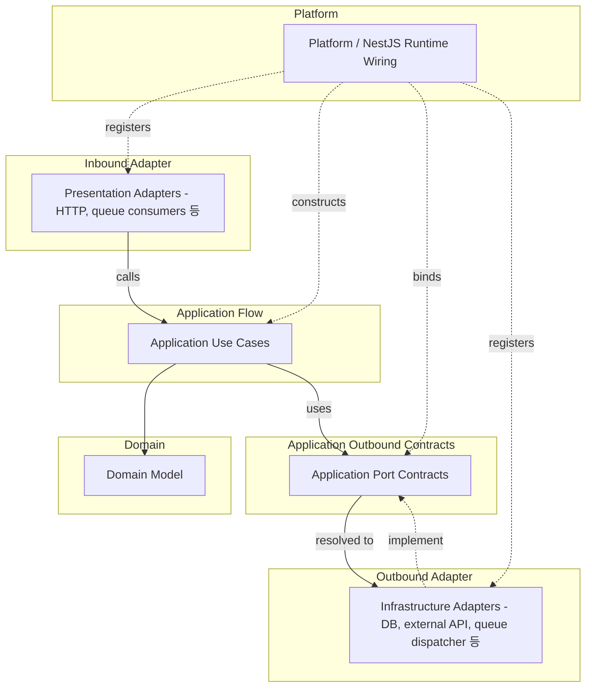

# API Runtime Wiring 컨벤션

## 적용 범위

- 객체 생성, provider 연결, port 구현체 등록, NestJS DI 사용, runtime 설정 소유권을 결정할 때 이 문서를
  사용한다.
- 한 소스 파일이 다른 소스 파일을 import할 수 있는지는
  [source dependency 컨벤션](./source-dependency.md)을 사용해 판단한다.
- Runtime wiring은 source dependency 규칙을 약화해서는 안 된다.

## Runtime Model

### Runtime Flow And Wiring Map

- 이 다이어그램은 소스 import가 아니라 runtime 흐름과 provider 연결을 보여준다.
  - 실선 화살표는 runtime 호출 또는 사용 방향을 나타낸다.
  - 점선 화살표는 provider 등록, 연결 또는 구현을 나타낸다.

## Platform

- `src/main.ts`는 얇은 프로세스 진입점으로 유지한다.
- `platform`은 애플리케이션 시작과 runtime 배선을 소유한다.
  - NestJS 루트 모듈, 시작 함수, runtime 설정 로딩, 전역 filter, interceptor, guard, pipe,
    앱 수준 provider 배선에는 `platform/nest`를 사용한다.
  - `platform`은 바운디드 컨텍스트, 어댑터, kernel, `core`, framework, 외부 runtime library에 의존할 수 있다.
  - `platform`은 비즈니스 규칙을 담아서는 안 된다.

## Environment Configuration

- 환경 변수 정의는 그 값을 사용하는 경계에 속한다.
  - 소유자는 schema, 기본값, typed config mapper, 소유자별 검증 규칙을 정의하는 것이 좋다.
- 로컬 API runtime 값은 commit하면 안 되는 `apps/api/.env`에 둔다.
- `NODE_ENV`는 Node runtime mode를 나타내며 API 앱 환경을 선택한다 (`development`, `production`, `test`).
- Runtime selector의 허용 값과 기본값은 그 값을 소유하는 typed config schema 또는 mapper에 둔다.
- `platform`은 앱 수준과 선택 수준의 환경 schema를 모은다.
  - 프로세스 시작 시 API runtime 검증을 실행한다.
- 어댑터의 환경 변수 schema와 typed config parser는 해당 어댑터 디렉터리가 소유한다.
  - 예를 들어 어댑터 파일 옆에 `*.config.ts` 파일을 둔다.
  - 어댑터 클래스는 `ConfigService`나 `process.env`를 직접 읽어서는 안 된다.
  - 이미 parsing된 typed options 객체를 생성자로 받아야 한다.
- Runtime 배선에서 raw `process.env`를 검사해야 한다면 소유자가 제공하는 selector helper를 호출하는 것이 좋다.
  - 조건부 모듈 등록이 한 예다.
  - 설정 경계가 소유하는 문자열 비교를 중복하지 않는다.
- Production 코드는 검증된 typed config provider 또는 `ConfigService` 값을 사용하는 것이 좋다.
  - Production 코드는 `process.env`를 직접 읽지 않는 것이 좋다.

## NestJS DI

### DI 경계

- NestJS DI는 `platform/nest`, presentation 어댑터, infrastructure 어댑터, application 유스 케이스 또는
  서비스의 runtime 배선에 사용할 수 있다.
- NestJS DI 때문에 도메인 코드에서 NestJS로 소스 의존성이 생겨서는 안 된다.
- Application 유스 케이스와 서비스는 생성자 주입을 위한 좁은 metadata를 사용할 수 있다.
  - `@Injectable()`, `@Inject()`, provider token이 이에 해당한다.
  - 유스 케이스는 명시적인 의존성으로 생성할 수 있는 일반 TypeScript 클래스로 유지하는 것이 좋다.
  - 유스 케이스 동작은 request 객체, module reference, container lookup, lifecycle callback 또는 다른 NestJS
    runtime API에 의존해서는 안 된다.
- Provider 등록과 모듈 조립은 `platform/nest` 또는 바운디드 컨텍스트 루트 모듈에 둔다.
  - 바운디드 컨텍스트 루트 모듈은 해당 컨텍스트의 application, presentation, infrastructure provider를
    조립할 수 있다.
  - 유스 케이스 폴더마다 모듈을 만들기보다 바운디드 컨텍스트 또는 runtime 경계 단위로 조립한다.

### 동적 모듈 조립

- `forRoot()`/`forFeature()` 같은 `DynamicModule` factory는 호출할 때마다 새 module instance를 반환한다.
  - NestJS는 import path가 다른 동적 모듈을 중복 제거하지 않는다.
  - 여러 import path가 같은 `forRoot()`에 도달하면 각 path가 모듈을 인스턴스화한다.
  - 해당 모듈의 listener, consumer, controller도 함께 중복 등록된다.
- `forRoot()`와 `forFeature()`를 모두 제공하는 바운디드 컨텍스트 루트 모듈은 책임을 분리해야 한다.
  - Event listener, queue consumer, scheduler, controller는 `forRoot()`에만 둔다.
  - `forFeature()`에는 여러 번 생성해도 안전한 stateless provider만 둔다.
  - Token과 repository가 stateless provider의 예다.
- Provider의 `forFeature()` 포함 여부는 현재 consumer가 아니라 stateless 여부로 결정한다.
  - 현재 유일한 consumer가 사용하지 않는다는 이유로 stateless provider를 제거하지 않는다.
- Consumer마다 서로 겹치지 않는 provider 일부가 필요하다면 호출 지점에서 provider를 선택하게 한다.
  - 예: `forFeature(tokens)`.
  - 현재 consumer에 맞춰 공통 export 목록을 계속 조정하지 않는다.
- 컨텍스트의 `forRoot()`는 조립을 소유하는 모듈에서 한 번만 import한다.
  - Provider만 필요한 다른 모듈은 `forRoot()`가 아니라 `forFeature()`를 import해야 한다.

### 어댑터 생성

- 어댑터를 조립하는 모듈이 생성 책임을 소유한다.
  - 모듈에서 `ConfigService`를 읽고 어댑터가 소유한 config parser를 호출한다.
  - `useFactory`를 통해 어댑터를 생성한다.
  - 어댑터 클래스에 `ConfigService`를 주입하지 않는다.
- 조정 가능한 설정을 나타내는 생성자 매개변수에는 기본값을 두어서는 안 된다.
  - Provider를 조립하는 모듈이 하드코딩된 상수를 포함한 구체적인 값을 소유한다.
  - 조립하는 모듈이 `useFactory` 또는 일반 생성자 호출을 통해 값을 명시적으로 전달한다.

### Factory Provider 생명주기

- `useFactory`로 생성하는 어댑터에는 `@Injectable()`이 필요하지 않다.
  - NestJS는 factory가 만든 instance에도 `OnModuleDestroy` 같은 lifecycle hook을 호출한다.
- 같은 모듈 안에서 `useFactory` 결과를 다른 `useFactory`로 전달하기 위한 DI token은 모듈 내부에 둔다.
  - 다른 모듈이 같은 값을 실제로 주입받아야 할 때만 token을 export한다.
- 어댑터 설정 parsing과 어댑터 생성은 하나의 `useFactory`에서 처리할 수 있다.
- Container가 어댑터 instance를 별도로 추적해야 할 때만 설정 parsing과 생성을 다른 provider로 나눈다.
  - 어댑터가 lifecycle hook을 구현하지만 공개 token은 파생된 값만 제공하는 경우가 이에 해당한다.
  - 어댑터 instance provider가 없으면 NestJS가 해당 instance의 lifecycle hook을 호출할 수 없다.

## Port Binding

- Port는 application이 소유하는 경계 계약이며 모든 interface, error type, DTO, mapper 또는 공유 계약을
  의미하지 않는다.
- 계약 파일과 타입 이름은 [infrastructure 컨벤션](./infrastructure.md)을 따른다.
- Runtime 배선은 소스 의존성을 뒤집지 않고 외부 구현체를 내부 port에 연결할 수 있다.
  - Infrastructure 어댑터는 application port를 구현할 수 있다.
  - `platform` 또는 바운디드 컨텍스트 배선이 각 port의 구현체를 등록한다.
- Runtime 배선을 이유로 domain 또는 application core에 금지된 import를 추가하면 안 된다.

## Non-Port Contracts

- 모든 경계 타입을 port로 분류하지 않는다.
  - Presentation DTO, mapper, failure response는 protocol adapter 계약이다.
  - Infrastructure exception과 persistence mapper는 어댑터 관심사다.
- Application core가 외부 레이어 계약을 사용해야 한다면 계약을 안쪽으로 옮긴다.
  - Application port 또는 application-kernel 계약으로 모델링한다.
