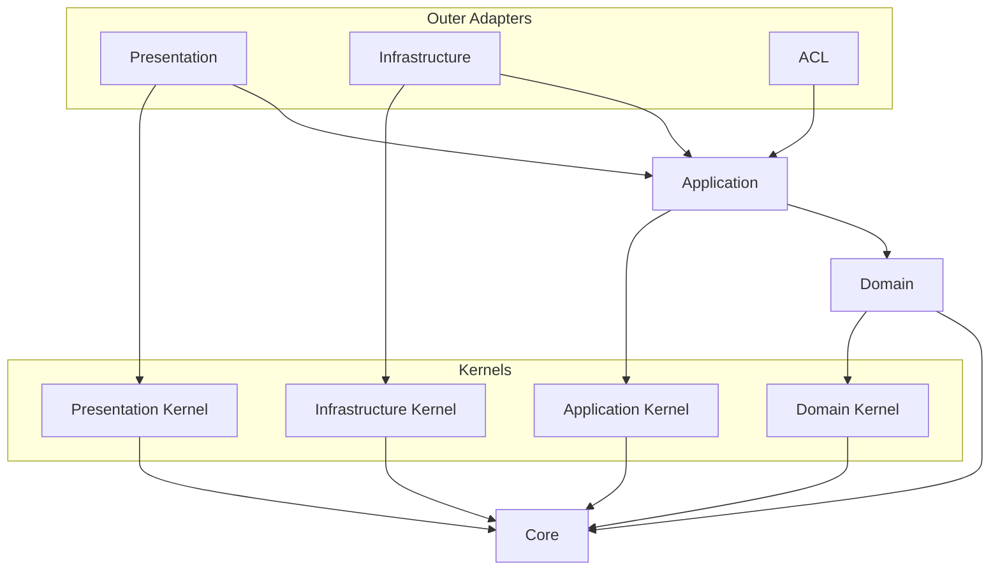

# API Source Dependency 컨벤션

## 적용 범위

- Import 방향, 소스 레이어 소유권, 프로젝트 path alias, public surface를 결정할 때 이 문서를 사용한다.
- 구현체가 runtime에서 어떻게 생성되거나 연결되는지는
  [runtime wiring 컨벤션](./runtime-wiring.md)을 사용해 판단한다.
- 의존성 방향은 외부 레이어에서 내부 레이어로 일관되게 향해야 한다.

## Dependency Direction

### Visual Dependency Map

- 모든 화살표는 "소스가 대상을 import할 수 있다"는 뜻으로 읽는다.
  - 다이어그램에 없거나 라우팅된 컨벤션이 명시적으로 허용하지 않은 의존성은 기본적으로 금지한다.

- `acl`은 다른 바운디드 컨텍스트의 public surface(`@contexts/<other-context>`)에도 의존한다 — 이 다이어그램은 한
  컨텍스트 내부 의존성만 그린 것이라 위에는 표시되지 않았다. 그 크로스 컨텍스트 엣지는
  [context integration 컨벤션](./context-integration.md)을 따른다.

## Import Surface

### Import Path 정책

- Project path alias는 [`apps/api/tsconfig.json`](../../../tsconfig.json)에만 선언한다.
- TypeScript, Vitest, 정적 분석 도구는 `tsconfig.json`을 사용하는 것이 좋다.
  - 도구마다 프로젝트 alias의 의미를 다시 정의하지 않는다.
- Path alias는 일반적인 경로 축약이 아니라 안정적인 아키텍처 경계를 표현한다.
  - `@core/*`, `@kernels/*`, `@contexts/*`, `@platform/*` 같은 소스 경계로 제한한다.
  - `@api/*`, `@src/*`, `@/*` 같은 포괄적인 alias는 추가하지 않는다.
- Production 코드가 alias가 있는 소스 경계를 넘을 때는 해당 alias를 사용한다.
  - 같은 구현 영역 안에서는 상대 경로 import를 선호한다.

### Public Surface 정책

- `index.ts`는 의도적으로 공개하는 계약의 public surface로 사용하며 기본 폴더 장식으로 만들지 않는다.
  - `index.ts`를 기계적으로 만들거나 폴더 내부의 모든 export를 다시 노출하지 않는다.
- Public surface에는 다른 소스 영역이 실제로 import해야 하는 계약만 노출한다.
  - 외부 계약이 아닌 내부 구현, helper, 어댑터 세부사항, test fixture, 지역 타입은 노출하지 않는다.
- 경계를 넘는 import는 public surface가 있다면 그 surface를 대상으로 하는 것이 좋다.
  - Kernel, 컨텍스트 도메인 코드, application port로 들어가는 production import도 public surface를 사용한다.
- 라우팅된 컨벤션이 명시적으로 허용하지 않는 한 다른 컨텍스트나 레이어 내부로 deep import하지 않는다.
  - 크로스 컨텍스트 어댑터와 배선 import는
    [context integration 컨벤션](./context-integration.md)을 따른다.

## Source Area

### Core

- `core`는 레이어, framework, 바운디드 컨텍스트, 비즈니스 용어가 없는 순수 primitive를 담는다.
- 모든 레이어는 `core`에 의존할 수 있다.
- `core`는 프로젝트 레이어, framework, 외부 SDK, 비즈니스 개념에 의존해서는 안 된다.

### Domain Layer

- Domain 레이어는 비즈니스 규칙과 도메인 모델을 소유한다.
  - 도메인 모델 소유권과 구성 요소는 [DDD 컨벤션](./ddd.md)을 따른다.
- Domain 코드는 `core`와 `kernels/domain`에 의존할 수 있다.
- Domain 코드는 application, infrastructure, presentation, platform, framework, 데이터베이스, HTTP, SDK
  코드에 의존해서는 안 된다.

### Application Layer

- Application 레이어는 유스 케이스와 application 흐름을 소유한다.
- Application 코드는 `core`, domain 코드, `kernels/application`, 같은 컨텍스트의 `*.di-tokens.ts`에
  의존할 수 있다.
- Application 코드는 객체 생성만 설명하는 좁은 NestJS DI API를 사용할 수 있다.
  - Provider decorator와 injection token이 이에 해당한다.
  - 유스 케이스를 일반 TypeScript 클래스로 생성할 수 있도록 의존성을 생성자에 명시한다.
- Application 동작은 infrastructure 구현체, presentation DTO, platform 구체 타입, 모듈 설정, container
  lookup 또는 framework lifecycle callback에 의존해서는 안 된다.
- Application 코드는 복구하거나 application 소유 맥락을 추가할 수 없다면 domain, infrastructure, system
  exception을 그대로 전파하는 것이 좋다.
  - 예외 소유권과 변환은 [오류 정책](../operability/error.md)을 따른다.

### Infrastructure Layer

- Infrastructure는 아웃바운드(driven) 어댑터 레이어다.
  - Application 소유 port 또는 domain/application 계약을 구현해 구체 기술에 접근한다.
  - 어댑터 이름과 구조는 [infrastructure 컨벤션](./infrastructure.md)을 따른다.
- Infrastructure 코드는 어댑터 구현을 위해 `core`, domain, application, `kernels/infrastructure`, framework,
  외부 라이브러리에 의존할 수 있다.
  - 어댑터 클래스는 framework의 DI 컨테이너가 이미 하는 일을 재구현하는 수작업 factory 함수보다, framework
    고유의 생성/의존성 주입(예: NestJS `@Injectable()` + 생성자 주입)을 기본으로 사용하는 것이 좋다.
  - 어댑터를 framework에서 분리해 두는 것은 구체적인 이유가 있을 때만 한다 — 예를 들어 DI 컨테이너를 부트스트랩하지
    않고 순수 생성자 호출로 단위 테스트하고 싶거나, 이 런타임 밖에서 재사용해야 하는 경우.
- Infrastructure 코드는 presentation이나 platform 시작 코드에 의존해서는 안 된다.
- 어댑터 코드는 기술별 오류에 맥락을 추가할 때 `cause`가 있는 `Error`로 감쌀 수 있다.
  - 오류 소유권과 변환은 [오류 정책](../operability/error.md)을 따른다.

### Anti-Corruption Layer (ACL)

- ACL은 컨슈머 소유 포트를 구현해서 바운디드 컨텍스트 경계를 넘는다.
  - 어댑터 이름, 위치, 프로듀서/컨슈머 네이밍 어휘는 [context integration 컨벤션](./context-integration.md)을 따른다.
- ACL 코드는 `core`, 이 컨텍스트 자신의 `application/ports`, 그리고 다른 컨텍스트의 public surface
  (`@contexts/<other-context>`, 즉 그 컨텍스트의 `index.ts`)에 의존할 수 있다.
- ACL 코드는 이 컨텍스트 자신의 domain이나 infrastructure 내부, presentation, platform에 의존해서는 안 된다.
- ACL 코드는 다른 컨텍스트의 domain, infrastructure, presentation, 루트 레벨 배선 파일에 의존해서는 안 된다 —
  그 컨텍스트의 `index.ts` public surface만 의존할 수 있다.

### Presentation Layer

- Presentation은 인바운드(driving) 어댑터 레이어다.
  - 외부 트리거를 받아 application 소유 port 없이 application 유스 케이스를 호출한다.
- Presentation 코드는 `core`, application, `kernels/presentation`, framework, protocol library에 의존할 수 있다.
  - 어댑터 클래스는 framework의 DI 컨테이너가 이미 하는 일을 재구현하는 수작업 factory 함수보다, framework
    고유의 생성/의존성 주입(예: NestJS `@Injectable()` + 생성자 주입)을 기본으로 사용하는 것이 좋다.
  - 어댑터를 framework에서 분리해 두는 것은 구체적인 이유가 있을 때만 한다 — 예를 들어 DI 컨테이너를 부트스트랩하지
    않고 순수 생성자 호출로 단위 테스트하고 싶거나, 이 런타임 밖에서 재사용해야 하는 경우.
- Presentation 코드는 infrastructure 구현체, 데이터베이스 어댑터, SDK 어댑터에 의존해서는 안 된다.
- Presentation에는 프로토콜 진입점과 비프로토콜 인바운드 트리거가 포함된다.
  - 프로토콜 진입점에는 HTTP controller, GraphQL resolver, DTO, protocol mapper, HTTP error mapper가 있다.
  - 비프로토콜 트리거에는 큐/message consumer와 scheduled job trigger가 있다.
  - HTTP 사용 여부가 아니라 어댑터가 application 호출을 시작하는지로 분류한다.
- 프로토콜을 처리하는 presentation 코드는 protocol exception을 응답으로 변환하고 masking 정책을 적용한다.
  - 비프로토콜 트리거에는 변환할 protocol response가 없다.
  - Masking과 예외 변환은 [오류 정책](../operability/error.md)을 따른다.

### 기술 결합 어댑터 분류

- 기술 결합 어댑터는 사용하는 기술이 아니라 방향으로 분류한다.
  - Application 호출을 시작하는 어댑터는 driving이며 presentation에 속한다.
  - Application 소유 port를 구현하는 어댑터는 driven이며 infrastructure에 속한다.
  - 큐 consumer는 presentation이고, 큐 dispatcher 또는 producer는 infrastructure다.
- 두 방향의 책임이 다르므로 같은 기술이 한 기능의 양쪽에 나타날 수 있다.

### 배선 영역

- 바운디드 컨텍스트 루트 배선 모듈은 해당 컨텍스트의 application, presentation, infrastructure, ACL 코드를
  import할 수 있다.
  - 다른 컨텍스트의 내부 구현을 임의로 조립해서는 안 된다.
- `platform`은 시작과 모듈 배선을 위해 바운디드 컨텍스트, 어댑터, kernel, `core`, framework, 외부 runtime
  library를 import할 수 있다.
  - 얇은 `src/main.ts` 진입점을 제외하고 `platform` 밖 production 코드는 `platform`을 import해서는 안 된다.

### Kernel Directory

- Kernel 디렉터리는 `core`에 의존할 수 있다.
- Kernel 디렉터리는 바운디드 컨텍스트, platform, framework 또는 외부 레이어에 의존해서는 안 된다.
- 기능별 정책은 소유하는 바운디드 컨텍스트 내부에 둔다.
  - Kernel 디렉터리를 일반적인 유틸리티 모음으로 만들면 안 된다.

### Event Emitter 예외

- Domain 코드와 `kernels/domain`은 명시적 예외로 Node.js 내장 `EventEmitter`에 의존할 수 있다.
  - 이 예외는 framework event emitter를 포함하지 않는다.
- Application 코드는 application event와 domain event를 발행하거나 처리할 때만 `@nestjs/event-emitter`에
  의존할 수 있다.
  - 이 예외는 application 코드에서 다른 NestJS runtime 의존성을 허용하지 않는다.
