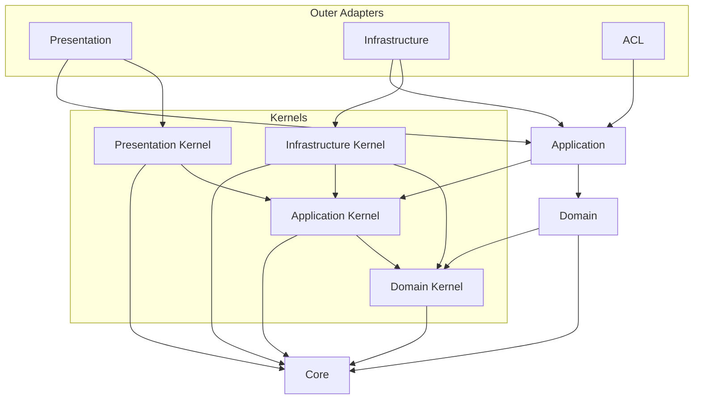

# API Source Dependency 컨벤션

## 적용 범위

- Import 방향, 소스 레이어 소유권, path alias, public surface를 결정할 때 이 문서를 사용한다.
- 구현체를 어떻게 생성하고 연결하는지는 [runtime wiring 컨벤션](./runtime-wiring.md)에서 결정한다.
- 개별 import가 허용되는지는 대부분 `apps/api/dependency-cruiser/rules/source-dependency.cjs`가 강제한다.
  위반하면 규칙 이름과 이유가 담긴 메시지가 나오므로, 이 문서는 규칙 목록을 반복하지 않고 방향과 판단 기준만 설명한다.

## Dependency Direction

- 의존성은 바깥 레이어에서 안쪽 레이어로만 향한다.
- 화살표는 "출발지가 도착지를 import할 수 있다"로 읽는다. 표시되지 않은 의존성은 금지로 본다.

- `acl`은 다른 바운디드 컨텍스트의 public surface(`@contexts/<other-context>`)에도 의존한다. 위 다이어그램은 한 컨텍스트
  내부만 다루므로 그 간선은 생략했다. 크로스 컨텍스트 간선은 [context integration 컨벤션](./context-integration.md)을 따른다.

## Source Area

| 영역 | 책임 | 의존할 수 있는 대상 |
|---|---|---|
| `core` | 레이어·framework·컨텍스트·비즈니스 용어가 없는 순수 primitive | 없음 |
| `<context>/domain` | 비즈니스 규칙과 도메인 모델 | `core`, `kernels/domain` |
| `<context>/application` | 유스 케이스와 application 흐름 | `core`, 같은 컨텍스트 domain, `kernels/application`, 같은 컨텍스트 `*.di-tokens.ts`, DI metadata 용도의 `@nestjs/common` |
| `<context>/infrastructure` | 아웃바운드(driven) 어댑터 | `core`, domain, application, `kernels/infrastructure`, framework, 외부 라이브러리 |
| `<context>/presentation` | 인바운드(driving) 어댑터 | `core`, application, `kernels/presentation`, framework, protocol library |
| `<context>/acl` | 다른 컨텍스트로 나가는 컨슈머 소유 포트 구현 | `core`, 같은 컨텍스트 `application/ports`, 다른 컨텍스트의 `index.ts` |
| `kernels/*` | 컨텍스트에 공통인 계약과 구현 | 대응하는 컨텍스트 레이어와 같은 내부 방향. 바운디드 컨텍스트와 `platform`에는 의존하지 않는다 |
| `platform` | 프로세스 시작과 runtime 배선 | 컨텍스트, 어댑터, kernel, `core`, framework. 반대로 `src/main.ts`를 제외한 production 코드는 `platform`을 import하지 않는다 |

- Domain과 application은 위 표에 없는 것을 import하지 않는다. 특히 데이터베이스, HTTP, SDK, framework runtime API,
  container lookup, lifecycle callback에 의존하지 않는다.
- Application 코드는 framework 기능이 필요할 때 그 패키지를 직접 import하지 않고, 이미 소유한 계약을 통해 접근한다.
  - Integration event 발행은 application 커널의 `IntegrationEventDispatcher` 계약을 쓰고, event emitter를 들고 있는
    어댑터는 `platform`에 둔다.
- 예외 전파와 변환은 [오류 정책](../operability/error.md), 어댑터 이름과 파일 구조는
  [infrastructure 컨벤션](./infrastructure.md), 도메인 모델 소유권은 [DDD 컨벤션](./ddd.md)을 따른다.

## Import Path

- Path alias는 [`apps/api/tsconfig.json`](../../../tsconfig.json) 한 곳에만 선언하고, TypeScript·Vitest·정적 분석 도구가
  그 파일을 함께 읽는다. 도구마다 alias 의미를 다시 정의하지 않는다.
- Alias는 경로를 짧게 만드는 수단이 아니라 아키텍처 경계의 이름이다.
  - `@core/*`, `@kernels/*`, `@contexts/*`, `@platform/*`처럼 이름 있는 경계에만 alias를 둔다.
  - `@api/*`, `@src/*`, `@/*` 같은 광범위한 alias는 추가하지 않는다.
- 경계를 넘을 때는 alias를 쓰고, 같은 구현 영역 안에서는 상대 경로를 쓴다.

## Public Surface

- `index.ts`는 의도적으로 공개하는 계약의 창구이지 폴더 장식이 아니다. 기계적으로 만들거나 내부 export를 전부
  다시 내보내지 않는다.
- 다른 소스 영역이 실제로 import해야 하는 계약만 노출한다. 내부 구현, 헬퍼, 어댑터 세부사항, 테스트 fixture,
  로컬 전용 타입은 노출하지 않는다.
- 경계를 넘는 import는 public surface가 있으면 그것을 대상으로 한다. kernel, 컨텍스트 domain, application port가 여기에
  해당한다.
- 다른 컨텍스트나 레이어 내부로의 deep import는 라우팅된 컨벤션이 명시적으로 허용할 때만 한다.

## 정적 검사가 판단하지 못하는 것

### 어댑터 방향 분류

- 기술 결합 어댑터는 사용하는 기술이 아니라 방향으로 분류한다.
  - Application 호출을 시작하면 driving이고 presentation에 속한다. 큐 consumer가 여기 해당한다.
  - Application 소유 port를 구현하면 driven이고 infrastructure에 속한다. 큐 dispatcher와 producer가 여기 해당한다.
- 두 방향의 책임이 다르므로 같은 기술이 한 기능의 양쪽에 나타날 수 있다.

### Kernel 승격 기준

- 의존성 방향이 허용된다는 사실만으로 컨텍스트별 구현을 kernel에 둘 수 있는 것은 아니다.
- 여러 컨텍스트가 어댑터의 동작과 lifecycle을 모두 실제로 재사용할 때만 `kernels/infrastructure`로 승격한다.
  그렇지 않으면 소유 컨텍스트의 infrastructure에 둔다.
- 여러 컨텍스트가 import할 수 있게 하려는 목적으로 feature event, payload, 정책을 kernel로 옮기지 않는다.
  Kernel은 간접적인 크로스 컨텍스트 통합 창구가 아니다. 소유 컨텍스트의 public contract와
  [context integration 컨벤션](./context-integration.md)을 사용한다.
- `kernels/application`과 `kernels/domain`의 계약은 기술 중립적으로 유지한다. DB row, ORM query builder, queue job,
  HTTP 객체, 어댑터 설정을 이 계약으로 노출하지 않는다.
- Kernel 디렉터리를 일반 유틸리티 모음으로 만들지 않는다. 기능별 정책은 소유 컨텍스트 안에 둔다.

### 어댑터 생성 방식

- 어댑터 클래스는 framework의 DI 컨테이너가 이미 하는 일을 재구현하는 수작업 factory보다 framework 고유의 생성과
  주입(예: NestJS `@Injectable()` + 생성자 주입)을 기본으로 한다.
- 어댑터를 framework에서 분리해 두는 것은 구체적인 이유가 있을 때만 한다. DI 컨테이너를 부트스트랩하지 않고 순수
  생성자 호출로 단위 테스트하려는 경우나 이 런타임 밖에서 재사용해야 하는 경우가 그렇다.
