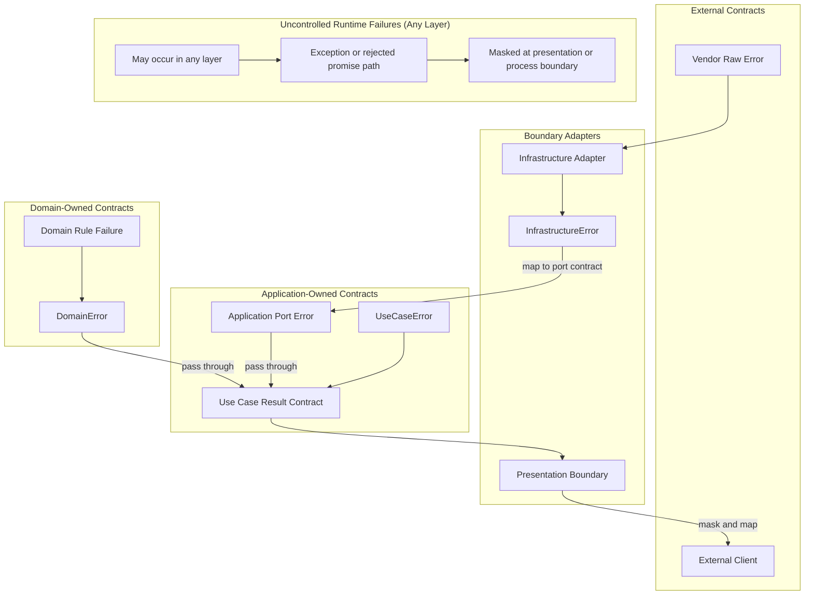

# API 오류 정책

오류는 API 제어 흐름과 계약의 일부다.

## 적용 범위

- 이 문서는 실패의 의미, 소유 경계, 변환 시점, 노출 가능한 정보를 판단할 때 사용한다.
- 이 정책은 애플리케이션이 제어하는 오류, 벤더 원본 오류, 예상하지 못한 시스템 오류, 프로토콜 대상 오류 응답을 다룬다.

## 실패 소유권

### 제어 가능한 오류와 제어 불가능한 실패

먼저 애플리케이션이 그 실패를 계약으로 소유하는지 판단한다.
이 프로젝트는 애플리케이션이 제어하는 오류와 애플리케이션이 합리적으로 제어할 수 없는 실패를 구분한다.

- 애플리케이션이 제어하는 오류는 애플리케이션 코드 또는 경계가 소유하는 예상 가능한 실패 값이다. `DomainError`, `ApplicationError`, `InfrastructureError` 같은 오류 이름을 사용하는 것이 좋다.
- 벤더 원본 오류는 애플리케이션이 변환하기 전 외부 어댑터, SDK, 데이터베이스, HTTP 클라이언트, 프레임워크에서 온 실패다.
- 시스템 오류는 일반 애플리케이션 계약으로 처리할 수 없는 예상하지 못한 런타임, 프로세스, 네트워크, OS, 리소스, 환경 실패다.
- 로깅은 관측 가능성을 도울 수 있지만, 로깅만으로 실패 처리가 되지는 않는다.

### 제어 가능한 오류의 소유자

애플리케이션이 제어하는 오류는 의미를 소유한 경계 기준으로 분류한다:

- 도메인 오류: 비즈니스 규칙 실패와 도메인 불변식 위반.
- 애플리케이션 오류: 유스케이스, 오케스트레이션, 애플리케이션 소유 계약 실패.
- 인프라 오류: 애플리케이션이 제어하는 형태로 변환된 기술 어댑터 실패.
- 표현 계층 오류: HTTP, GraphQL, 요청 검증 실패 같은 프로토콜 대상 실패 응답.

## 변환 경계

오류는 소유자, 대상 독자, 계약이 바뀌는 경계를 건널 때 변환하는 것이 좋다.

- 어댑터 경계는 실패를 이해할 수 있을 때 벤더 원본 오류를 인프라 오류 또는 다른 애플리케이션 제어 오류로 변환한다.
- 유스케이스는 같은 bounded context에서 온 domain error를 기본적으로 그대로 전파하는 것이 좋다. Use case error는 orchestration 또는 application이 소유한 실패를 표현해야 한다.
- 같은 application boundary 안에서 application이 소유한 port error가 호출자가 다룰 수 있는 계약이라면, use case는 그 port error를 그대로 전파할 수 있다.
- 유스케이스가 bounded context 또는 module 경계를 건너는 경우처럼 호출자에게 드러낼 다른 계약을 의도적으로 소유할 때만 domain error를 변환할 수 있다.
- 프로토콜 경계는 애플리케이션 오류를 표현 계층 오류 또는 던져지는 프로토콜 예외로 변환한다.
- 독립적인 bounded context 또는 module을 건너는 오류는 그 경계가 사용하는 통신 계약을 통해 변환한다.
- 표현 계층 경계는 외부 클라이언트에 오류, 예외, 시스템 오류를 노출하기 전에 반드시 마스킹을 적용해야 한다.

호출 스택이 내부 폴더 경계를 건넜다는 이유만으로 오류를 감싸지 않는다.
계약 안정성, 정보 은닉, 소유권, 호출자 동작을 개선할 때 변환하는 것을 선호한다.

## 오류 흐름

## 오류 계약 형태

정답인 오류 형태는 하나가 아니다.
애플리케이션이 제어하는 오류를 정의할 때는 소유 계약이 다르게 정할 이유가 없다면 다음 구조를 선호한다.

- `kind`: 경계 수준 처리를 위한 선택적이고 안정적인 분류값이다. 검증 실패, 의존성 사용 불가, 찾을 수 없음, 상태 충돌처럼 호출자가 명시적으로 다룰 수 있는 분류만 사용한다. 인식하지 못한 시스템 실패를 표현하기 위한 catch-all application error kind는 추가하지 않는다.
- `code`: 사람과 기계가 오류를 분류하는 안정적인 값이다. 호출자는 `message`를 파싱하지 말고 `code`에 의존하는 것이 좋다.
- `message`: 디버깅, 운영, 표현을 위한 사람이 읽을 수 있는 맥락이다. 변경, 지역화, 마스킹, 재작성이 가능하다. 프로그램 코드는 정확한 `message` 텍스트에 의존하면 안 된다.
- `details`: 호출자 동작 또는 기계 처리를 위한 최소 구조화 데이터다. 계약의 일부가 되므로 수신자가 의존해도 되는 데이터만 포함한다.

검증 오류는 호출자가 조치할 수 있을 때 필드 수준 세부 정보를 포함할 수 있다.
프로토콜 계약이 명시적으로 허용하지 않는 한 내부 진단 데이터를 표현 계층 오류로 노출하지 않는다.

## 벤더 오류 계약

벤더 원본 오류는 외부 계약이다.
Adapter code가 vendor error의 구조화된 필드를 읽는다면, application이 제어하는 error로 매핑하기 전에 adapter boundary에서 해당 필드를 검증하고 정규화한다.

- Adapter가 database error code, constraint name, SDK error code, HTTP client response metadata처럼 구조화된 vendor field에 의존한다면 외부 error contract에는 `zod` schema를 사용하는 것을 선호한다.
- 외부 enum-like code set은 `as const` object로 한 번 정의하고, 그 object에서 `zod` enum schema를 만들며, TypeScript type은 `z.infer`로 schema에서 파생한다.
- 같은 외부 code set에 대해 별도 TypeScript enum 또는 union과 별도 `zod` enum 목록을 따로 유지하지 않는다.
- Vendor error가 adapter가 소유하지 않는 field를 포함할 수 있다면 알 수 없는 vendor metadata를 허용하고, application contract에 필요한 field만 정규화한다.

## 예상하지 못한 시스템 오류

애플리케이션이 가능한 모든 던져진 값이나 실패를 알고 처리할 수는 없다.
경계에서는 명시적으로 이해하는 실패만 보존하고, 인식하지 못한 실패는 애플리케이션 바깥에 노출하기 전에 마스킹한다.

- 인식한 기술 실패는 호출자가 계약의 일부로 다룰 수 있을 때만 명시적인 애플리케이션 제어 분류로 변환한다.
- 인식하지 못한 실패는 표현 계층 또는 프로세스 경계가 안전한 내부 오류 응답으로 마스킹할 때까지 예외 또는 rejected promise 경로에 둔다.
- 내부 관측 가능성을 위해 가능하면 원래 원인을 보존한다.
- 인식하지 못한 실패는 로깅, 메트릭, 추적 또는 다른 운영 신호를 통해 관측 가능하게 만든다.
- 알 수 없는 실패를 처리하거나 관측 가능하게 만들지 않고 조용히 삼키지 않는다.

애플리케이션 바깥으로 보내는 예상하지 못한 시스템 오류 응답은 안정적이고 안전해야 하며 반드시 마스킹되어야 한다.
