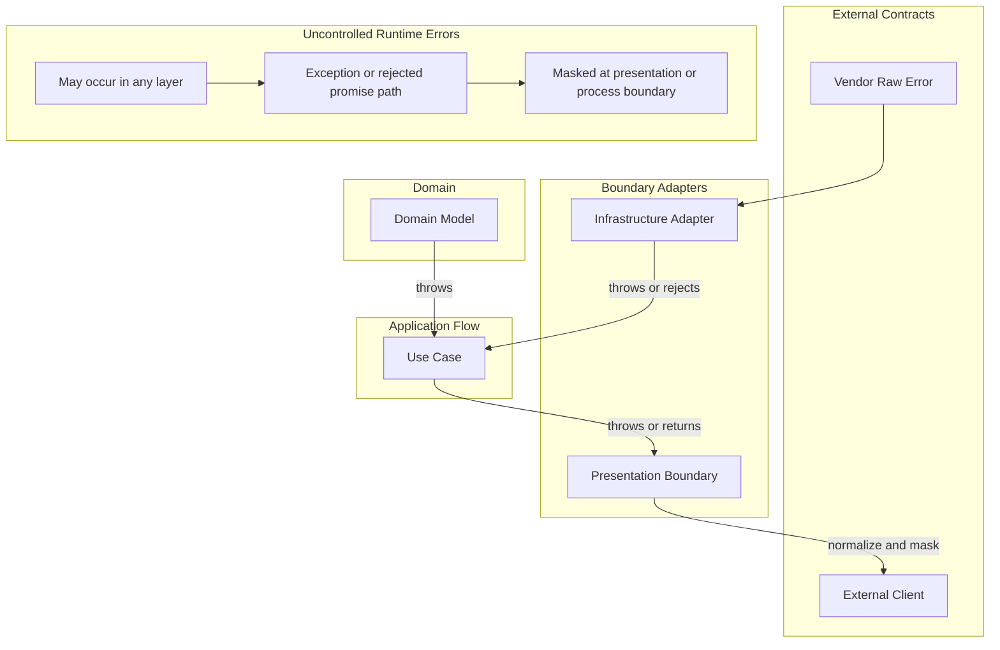

# API 오류 정책

Error는 API 제어 흐름과 외부 계약의 일부다.

## 적용 범위

- 이 문서는 error의 의미, 소유 경계, 변환 시점, 노출 가능한 정보를 판단할 때 사용한다.
- 이 정책은 throw된 exception, rejected promise, vendor raw error, 예상하지 못한 system error, protocol-facing error response를 다룬다.

## Error 소유권

### Exception과 Response 채널

이 프로젝트는 exception을 기본 error 채널로 사용한다.
구조화된 response envelope는 protocol-facing boundary에서만 사용한다.

- Throw된 error, exception, rejected promise는 중단된 control flow다. Domain invariant 실패, technical adapter 실패, operational failure, programming error에 사용한다.
- Request validation은 presentation boundary에서 처리하고, 구조화된 response body를 가진 protocol exception을 throw할 수 있다.
- Caller는 복구할 수 있거나, boundary context를 추가할 수 있거나, protocol response로 변환할 수 있을 때만 exception을 catch하는 것이 좋다.
- Application use case는 infrastructure, domain, system exception을 보통 그대로 전파한다.
- `Result`/failure-family contract를 기본으로 추가하지 않는다. Caller에게 안정적이고 유용한 branching behavior가 있고 exception propagation보다 명확할 때만 반환되는 failure contract를 도입한다.
- Domain constructor와 factory는 invariant를 throw로 방어한다. Boundary가 명시적으로 변환하지 않는 한, throw된 invariant failure는 bug, 손상된 persisted state, 또는 부족한 boundary validation으로 취급한다.

### Error Shape 계약

구조화된 error shape은 그것을 운반하는 채널과 무관한 데이터 계약으로 정의한다.

- 각 kernel 레이어는 `error.base.ts`에 error shape을 정의한다: `DomainErrorBase`, `ApplicationErrorBase`, `InfrastructureErrorBase`.
- Error shape은 `kind`, `code`, `message`, `details`를 담는다. `kind`는 실패를 분류하고, `code`는 caller와 기계가 안정적으로 식별할 수 있는 값이다.
- 같은 error shape을 exception 채널(`DomainException`, `ApplicationException`)이나 result 채널(`Result.err(error)`) 중 어느 쪽으로든 운반할 수 있다. 채널 선택은 데이터 shape이 아니라 caller가 실패에 따라 분기해야 하는지 여부로 결정한다.
- 레이어별 exception wrapper(`DomainException`, `ApplicationException`)는 error shape을 `error` 프로퍼티에 보관한다. boundary가 식별하고 변환해야 하는 structured error를 throw할 때 사용한다.
- HTTP presentation boundary는 `ApplicationErrorKind`를 HTTP status code로 매핑한다. Domain과 infrastructure error는 항상 `500`으로 mask한다.

### Error 소유자

Error는 의미를 소유한 경계 기준으로 분류한다:

- Domain error: transport, database, framework, SDK detail이 없는 business invariant와 domain model guard 실패.
- Application error: 특정 external adapter 또는 protocol이 소유하지 않는 use case와 orchestration 실패.
- Infrastructure error: database, SDK, HTTP client, file system, message broker, persistence failure를 포함한 technical adapter 실패.
- Presentation error: HTTP validation response 같은 protocol-facing exception과 response body.
- Vendor raw error: application code가 wrap 또는 mask하기 전 외부 adapter, SDK, database, HTTP client, framework에서 온 실패.
- System error: 일반 application contract로 처리할 수 없는 예상하지 못한 runtime, process, network, OS, resource, environment 실패.

Logging은 관측 가능성을 도울 수 있지만, logging만으로 error handling이 되지는 않는다.

## 변환 경계

Error는 소유자, 대상 독자, 노출 정책이 바뀌는 경계를 건널 때 변환한다.

- Adapter boundary는 adapter context를 추가할 때 vendor raw error를 `cause`가 있는 일반 `Error`로 감쌀 수 있다.
- Use case는 infrastructure dependency가 실패했다는 이유만으로 infrastructure exception을 변환하지 않는 것이 좋다.
- Protocol boundary는 알려진 protocol exception을 변환하고, 인식하지 못한 exception은 외부 client에 노출하기 전에 mask한다.
- 독립적인 bounded context 또는 module을 건너는 error는 그 경계가 사용하는 communication contract를 통해 변환한다.
- Presentation boundary는 domain, infrastructure, vendor, system, unknown error를 외부 client에 노출하기 전에 반드시 mask해야 한다.

호출 스택이 내부 folder boundary를 건넜다는 이유만으로 error를 감싸지 않는다.
정보 은닉, 소유권, 관측 가능성, caller behavior를 개선할 때 변환하는 것을 선호한다.

## Error 흐름

## Protocol Error Response 형태

Protocol-facing error response는 안정적인 envelope를 사용하는 것이 좋다.
HTTP response에는 소유 protocol이 다르게 정할 이유가 없다면 `kernels/presentation`의 `HttpErrorEnvelope`를 사용한다.

- `statusCode`: 숫자 protocol status.
- `code`: 사람과 기계가 response를 분류하는 안정적인 값이다. Caller는 `message`를 parsing하지 말고 `code`에 의존하는 것이 좋다.
- `message`: presentation 또는 debugging을 위한 사람이 읽을 수 있는 맥락이다. 변경, 지역화, masking, 재작성이 가능하다. Program code는 정확한 `message` text에 의존하면 안 된다.
- `details`: caller behavior 또는 machine processing을 위한 최소 structured data다. Response contract의 일부가 되므로 수신자가 의존해도 되는 data만 포함한다.

Validation response는 caller가 조치할 수 있을 때 field-level detail을 포함할 수 있다.
Protocol contract가 명시적으로 허용하지 않는 한 internal diagnostic data를 protocol response로 노출하지 않는다.

## Vendor Error 계약

Vendor raw error는 external contract다.
Adapter code가 vendor error의 structured field를 읽는다면 error를 wrap 또는 translate하기 전에 adapter boundary에서 해당 field를 검증하고 정규화한다.

- Adapter가 database error code, constraint name, SDK error code, HTTP client response metadata처럼 structured vendor field에 의존한다면 external error contract에는 `zod` schema를 사용하는 것을 선호한다.
- External enum-like code set은 `as const` object로 한 번 정의하고, 그 object에서 `zod` enum schema를 만들며, TypeScript type은 `z.infer`로 schema에서 파생한다.
- 같은 external code set에 대해 별도 TypeScript enum 또는 union과 별도 `zod` enum 목록을 따로 유지하지 않는다.
- Vendor error가 adapter가 소유하지 않는 field를 포함할 수 있다면 알 수 없는 vendor metadata를 허용하고, application contract에 필요한 field만 정규화한다.

## 예상하지 못한 System Error

Application이 가능한 모든 thrown value 또는 rejected promise를 알고 처리할 수는 없다.
Boundary에서는 명시적으로 이해하는 error만 보존하고, 인식하지 못한 error는 application 바깥에 노출하기 전에 mask한다.

- 인식한 technical failure는 외부 caller가 protocol contract의 일부로 다룰 수 있을 때만 명시적인 protocol response로 변환한다.
- 인식하지 못한 failure는 presentation 또는 process boundary가 안전한 internal response로 mask할 때까지 exception 또는 rejected-promise path에 둔다.
- 내부 관측 가능성을 위해 가능하면 원래 cause를 보존한다.
- 인식하지 못한 failure는 logging, metric, tracing 또는 다른 operational signal을 통해 관측 가능하게 만든다.
- 알 수 없는 failure를 처리하거나 관측 가능하게 만들지 않고 조용히 삼키지 않는다.

Application 바깥으로 보내는 예상하지 못한 system error response는 안정적이고 안전해야 하며 반드시 mask되어야 한다.
