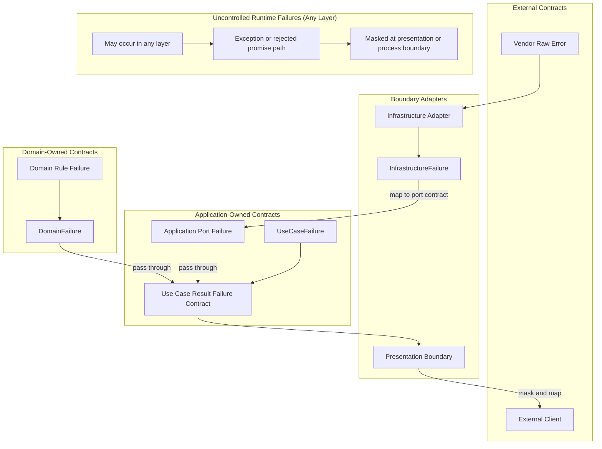

# API 오류 정책

Failure와 error는 API 제어 흐름과 계약의 일부다.

## 적용 범위

- 이 문서는 실패의 의미, 소유 경계, 변환 시점, 노출 가능한 정보를 판단할 때 사용한다.
- 이 정책은 애플리케이션이 제어하는 failure, 벤더 원본 오류, 예상하지 못한 시스템 오류, 프로토콜 대상 오류 응답을 다룬다.

## 실패 소유권

### 제어 가능한 오류와 제어 불가능한 실패

먼저 애플리케이션이 그 실패를 계약으로 소유하는지 판단한다.
이 프로젝트는 애플리케이션이 제어하는 failure와 애플리케이션이 합리적으로 제어할 수 없는 실패를 구분한다.

- 애플리케이션이 제어하는 failure는 애플리케이션 코드 또는 경계가 소유하는 예상 가능한 실패 값이다. 재사용되는 controlled failure shape에는 `DomainFailure`, `ApplicationFailure`, `InfrastructureFailure` 같은 failure-family 이름을 사용한다.
- 벤더 원본 오류는 애플리케이션이 변환하기 전 외부 어댑터, SDK, 데이터베이스, HTTP 클라이언트, 프레임워크에서 온 실패다.
- 시스템 오류는 일반 애플리케이션 계약으로 처리할 수 없는 예상하지 못한 런타임, 프로세스, 네트워크, OS, 리소스, 환경 실패다.
- 로깅은 관측 가능성을 도울 수 있지만, 로깅만으로 실패 처리가 되지는 않는다.

### 제어 가능한 Failure의 소유자

애플리케이션이 제어하는 failure는 의미를 소유한 경계 기준으로 분류한다:

- Domain failure: 비즈니스 규칙 실패와 도메인 불변식 위반.
- Application failure: 유스케이스, 오케스트레이션, 애플리케이션 소유 계약 실패.
- Infrastructure failure: 애플리케이션이 제어하는 형태로 변환된 기술 어댑터 실패.
- Presentation failure: HTTP, GraphQL, 요청 검증 실패 같은 프로토콜 대상 실패 응답.

### Result Failure와 Exception 채널

- 호출자가 수정할 수 있는 검증 실패, 비즈니스 규칙 실패, 호출자가 분기해야 하는 value object factory 실패처럼 애플리케이션이 제어하는 계약으로 의도한 예상 가능한 실패에는 `Result`를 사용한다.
- 정책 문서에서는 `Result`의 실패 가지를 `Result failure`라고 부른다. `Result` 실패 계약을 구체적으로 설명하는 alias나 union은 `SourceRepositoryFailure`, `UploadSourceUseCaseFailure`처럼 `Failure` suffix로 이름 짓는다.
- 실패 가지에 담기는 shape를 이름 붙이는 재사용 failure-family type은 `DomainFailure`, `ApplicationFailure`, `InfrastructureFailure`처럼 `Failure` suffix로 이름 짓는다.
- `Result failure`는 반환되는 data다. Function signature에 드러나야 하고, caller branching으로 처리하는 것이 좋으며, caller가 조치할 수 있는 안정적인 contract를 표현해야 한다.
- Throw된 error, exception, rejected promise는 중단된 control flow다. 호출자에게 드러낼 유용한 계약이 아닌 예상하지 못한 기술, 운영, 프로그래밍 실패에 사용한다.
- Domain constructor는 내부 invariant를 throw로 방어한다. 여기에는 invalid identifier나 invalid props 같은 entity와 aggregate base invariant, 그리고 직접 constructor를 통해 도달한 value object invariant도 포함된다.
- Entity, aggregate, value object factory method는 명시적으로 조합하는 value-level domain failure에 대해 여전히 `Result`를 반환할 수 있지만, constructor guard failure는 exception 채널에 둔다.
- Constructor에서 throw된 invariant failure는 경계가 명시적으로 제어 가능한 failure contract로 변환하지 않는 한 bug, 손상된 persisted state, 또는 부족한 boundary validation으로 취급한다.
- Result plumbing을 피하기 위해 예상 가능한 `Result failure`를 throw하지 않는다. 경계가 안정적이고 caller가 조치할 수 있는 contract를 소유하지 않는 한 알 수 없는 thrown value를 `Result failure`로 변환하지 않는다.

## 변환 경계

Failure는 소유자, 대상 독자, 계약이 바뀌는 경계를 건널 때 변환하는 것이 좋다.

- 어댑터 경계는 실패를 이해할 수 있을 때 벤더 원본 오류를 infrastructure failure 또는 다른 application-controlled failure로 변환한다.
- 유스케이스는 같은 bounded context에서 온 domain failure를 기본적으로 그대로 전파하는 것이 좋다. Use case failure는 orchestration 또는 application이 소유한 실패를 표현해야 한다.
- 같은 application boundary 안에서 application이 소유한 port failure가 호출자가 다룰 수 있는 계약이라면, use case는 그 port failure를 그대로 전파할 수 있다.
- 유스케이스가 bounded context 또는 module 경계를 건너는 경우처럼 호출자에게 드러낼 다른 계약을 의도적으로 소유할 때만 domain failure를 변환할 수 있다.
- 프로토콜 경계는 application failure를 presentation failure 또는 던져지는 프로토콜 예외로 변환한다.
- 독립적인 bounded context 또는 module을 건너는 failure는 그 경계가 사용하는 통신 계약을 통해 변환한다.
- 표현 계층 경계는 외부 클라이언트에 failure, error, exception, system error를 노출하기 전에 반드시 마스킹을 적용해야 한다.

호출 스택이 내부 폴더 경계를 건넜다는 이유만으로 failure를 감싸지 않는다.
계약 안정성, 정보 은닉, 소유권, 호출자 동작을 개선할 때 변환하는 것을 선호한다.

## Failure 흐름

## Failure 계약 형태

정답인 failure 형태는 하나가 아니다.
애플리케이션이 제어하는 failure를 정의할 때는 소유 계약이 다르게 정할 이유가 없다면 다음 구조를 선호한다.

- `kind`: 경계 수준 처리를 위한 선택적이고 안정적인 분류값이다. 검증 실패, 의존성 사용 불가, 찾을 수 없음, 상태 충돌처럼 호출자가 명시적으로 다룰 수 있는 분류만 사용한다. 인식하지 못한 시스템 실패를 표현하기 위한 catch-all application failure kind는 추가하지 않는다.
- `code`: 사람과 기계가 failure를 분류하는 안정적인 값이다. 호출자는 `message`를 파싱하지 말고 `code`에 의존하는 것이 좋다.
- `message`: 디버깅, 운영, 표현을 위한 사람이 읽을 수 있는 맥락이다. 변경, 지역화, 마스킹, 재작성이 가능하다. 프로그램 코드는 정확한 `message` 텍스트에 의존하면 안 된다.
- `details`: 호출자 동작 또는 기계 처리를 위한 최소 구조화 데이터다. 계약의 일부가 되므로 수신자가 의존해도 되는 데이터만 포함한다.

검증 failure는 호출자가 조치할 수 있을 때 필드 수준 세부 정보를 포함할 수 있다.
프로토콜 계약이 명시적으로 허용하지 않는 한 내부 진단 데이터를 presentation failure로 노출하지 않는다.

## 벤더 오류 계약

벤더 원본 오류는 외부 계약이다.
Adapter code가 vendor error의 구조화된 필드를 읽는다면, application이 제어하는 failure로 매핑하기 전에 adapter boundary에서 해당 필드를 검증하고 정규화한다.

- Adapter가 database error code, constraint name, SDK error code, HTTP client response metadata처럼 구조화된 vendor field에 의존한다면 외부 error contract에는 `zod` schema를 사용하는 것을 선호한다.
- 외부 enum-like code set은 `as const` object로 한 번 정의하고, 그 object에서 `zod` enum schema를 만들며, TypeScript type은 `z.infer`로 schema에서 파생한다.
- 같은 외부 code set에 대해 별도 TypeScript enum 또는 union과 별도 `zod` enum 목록을 따로 유지하지 않는다.
- Vendor error가 adapter가 소유하지 않는 field를 포함할 수 있다면 알 수 없는 vendor metadata를 허용하고, application contract에 필요한 field만 정규화한다.

## 예상하지 못한 시스템 오류

애플리케이션이 가능한 모든 던져진 값이나 실패를 알고 처리할 수는 없다.
경계에서는 명시적으로 이해하는 실패만 보존하고, 인식하지 못한 실패는 애플리케이션 바깥에 노출하기 전에 마스킹한다.

- 인식한 기술 실패는 호출자가 계약의 일부로 다룰 수 있을 때만 명시적인 애플리케이션 제어 분류로 변환한다.
- 인식하지 못한 실패는 표현 계층 또는 프로세스 경계가 안전한 내부 오류 응답으로 마스킹할 때까지 예외 또는 rejected promise 경로에 둔다.
- 내부 관측 가능성을 위해 가능하면 원래 원인을 보존한다.
- 인식하지 못한 실패는 로깅, 메트릭, 추적 또는 다른 운영 신호를 통해 관측 가능하게 만든다.
- 알 수 없는 실패를 처리하거나 관측 가능하게 만들지 않고 조용히 삼키지 않는다.

애플리케이션 바깥으로 보내는 예상하지 못한 시스템 오류 응답은 안정적이고 안전해야 하며 반드시 마스킹되어야 한다.
