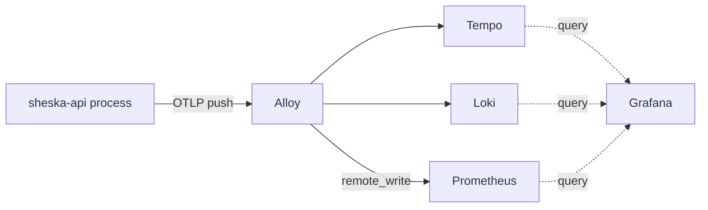

# API 옵저버빌리티 컨벤션

이 앱은 traces, logs, metrics를 OpenTelemetry(OTLP)로 클러스터 공통 collector에 push한다. 이 문서는 파이프라인 아키텍처, 전송 정책, 소유 경계를 다룬다. 무엇을 로그로 남길지, 어떤 레벨로 남길지는 [API 로깅 정책](./logging.md)을 읽는다 — 그 정책은 내용과 레벨을, 이 문서는 전송을 다룬다.

## 범위

- OTLP export 배선, 환경/endpoint 설정, telemetry에 붙는 리소스 속성 집합을 변경할 때 이 문서를 사용한다.
- Collector, 저장소, 대시보드(Alloy, Loki, Tempo, Prometheus, Grafana)는 이 레포가 아니라 별도의 `hash-infra` 레포가 소유한다. 이 레포는 계측 코드와 그것이 가리키는 endpoint만 소유한다.

## 파이프라인

세 신호 모두 환경과 무관하게 같은 경로로 push된다 — 로컬 pull 방식 대체 경로는 없다:

Metrics도 정책적으로 scrape가 아니라 push다: pull 방식 `ServiceMonitor`는 VPN 뒤에 있는 로컬 dev 프로세스에 닿을 수 없고, metrics만 다른 전송 방식을 쓰면 prod와 dev가 설정이 아니라 코드 수준에서 갈라진다.

`OTEL_EXPORTER_OTLP_ENDPOINT`가 유일하게 환경마다 달라지는 값이다 — production에서는 클러스터 내부 DNS 이름, 로컬 dev에서는 공유 스택의 VPN 노출 주소를 가리킨다. 둘 다 `hash-infra`의 같은 Alloy 인스턴스로 향한다.

## 소유 경계

`deployment.environment.name`은 모든 신호에 붙는다. 같은 클러스터 공통 백엔드를 공유하는 production telemetry와 로컬 dev telemetry를 Grafana에서 구분하기 위해서다.

Loki도 Prometheus도 OpenTelemetry 리소스 속성을 기본으로 조회 가능한 indexed label로 승격시키지 않는다. 각 백엔드마다 명시적 opt-in이 필요하고, 그 opt-in은 이 레포가 아니라 `hash-infra`의 Alloy 쪽이 소유한다. 이 레포에서 리소스 속성을 추가하면 raw payload엔 보이지만, 그것만으로 Grafana에서 필터링 가능해지진 않는다 — `hash-infra`의 Alloy 설정도 같이 바꿔야 한다.

**주의**: 다른 레포 소관이더라도, metrics에 대해 리소스 속성을 통째로 label로 승격시키는 방식(Alloy의 `resource_to_telemetry_conversion`)은 켜지 않는다. 이건 프로세스 재시작마다 바뀌는 값(`process.pid` 등)을 포함한 모든 리소스 속성을 승격시켜서, 재시작할 때마다 정리되지 않는 새 Prometheus 시계열을 만든다.

## 환경 정책

SDK는 `NODE_ENV`가 명시적 허용 목록(`production`, `development`)에 있고 `OTEL_EXPORTER_OTLP_ENDPOINT`가 설정돼 있을 때만 시작한다 — `test`만 제외하는 방식이 아니라 화이트리스트라서, 설정 안 됐거나 인식 못 하는 `NODE_ENV`는 telemetry를 흘려보내는 대신 fail-closed로 꺼진다. 새 배포 환경이 생기면 허용 목록을 확장한다.

Service 이름은 환경변수가 아니라 하드코딩된 상수다: 앱 자신의 정체성은 배포 설정이 아니라 코드베이스에 대한 고정된 사실이라, OTLP endpoint와 달리 `.env.*` 파일이나 Helm values에 들어갈 이유가 없다.

## Bootstrap

**주의**: OTel bootstrap은 `main.ts`의 가장 첫 import여야 하고, NestJS provider나 module이 되면 안 된다. Auto-instrumentation은 모듈(`http`, `express`, `pg`, `ioredis`)을 `require()` 시점에 patch하는데, Nest 자체의 부팅 순서를 포함해서 그 모듈들을 먼저 로드하는 건 무엇이든 해당 모듈에 대한 계측을 영구히 건너뛰게 만든다. 이건 어떤 프레임워크에서든 똑같이 적용되는 Node 모듈 로딩 제약이지, NestJS 전용 규칙이 아니다.

**주의**: bootstrap은 Nest의 `ConfigModule`을 거치지 않고 `dotenv`로 직접 `.env.${NODE_ENV}`를 로드한다. `ConfigService`를 쓰도록 리팩터링하지 않는다 — 이 모듈은 `AppModule`이 로드되기 전에 실행되므로, 그 시점엔 아직 소비할 typed config 자체가 존재하지 않는다.

## 로깅 통합

**주의**: trace correlation을 위한 커스텀 pino `mixin`이나 로그 전송을 위한 별도 pino transport를 추가하지 않는다. `@opentelemetry/instrumentation-pino`가 SDK 실행 중이면 이미 모든 pino 로그 레코드에 `trace_id`/`span_id`를 주입하고 OTel logs 파이프라인으로 전달한다 — 둘 다 다시 추가하면 데이터와 logger 설정이 중복된다.
