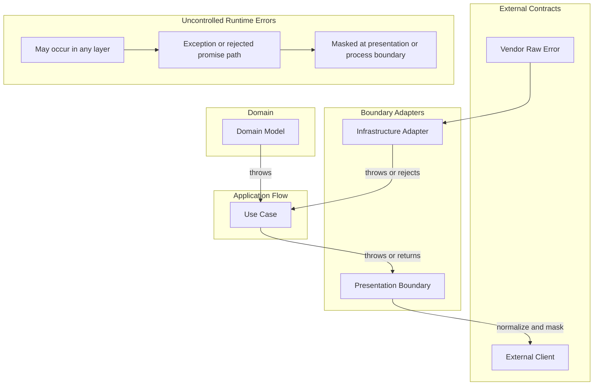

# API 오류 정책

## 적용 범위

- 오류의 의미, 소유권, 변환 시점, 노출 범위를 판단할 때 이 문서를 사용한다.
- 이 정책은 exception, rejected promise, vendor raw error, 예상하지 못한 system error, protocol error
  response를 다룬다.

## Error 소유권

### Exception과 Response 채널

- 이 프로젝트는 exception을 기본 오류 채널로 사용한다.
  - Domain 불변 조건 실패, 어댑터 실패, 운영 실패, programming error에는 exception 또는 rejected promise를
    사용한다.
- 구조화된 failure response는 protocol 경계에서만 사용한다.
  - Presentation의 request validation은 구조화된 response body가 있는 protocol exception을 던질 수 있다.
- 복구하거나 경계 맥락을 추가하거나 protocol response로 변환할 때만 exception을 catch하는 것이 좋다.
- Application 유스 케이스는 infrastructure, domain, system exception을 보통 그대로 전파한다.
- `Result` 또는 failure 계열 계약을 기본으로 추가하지 않는다.
  - 이 프로젝트에는 그런 계약이 아직 없다. 따라서 추가하는 것은 준비된 두 채널 중 하나를 고르는 일이 아니라
    별도의 결정이다.
  - 호출자에게 안정적이고 유용한 분기 동작이 있고 exception 전파보다 명확할 때만 failure 계약을 추가한다.
- Domain 생성자와 factory는 exception을 던져 불변 조건을 보호한다.
  - 경계가 명시적으로 변환하지 않는 불변 조건 실패는 bug, 손상된 저장 상태 또는 부족한 경계 검증으로
    취급한다.

### Error 클래스 계약

- 구조화된 error는 `core/errors`의 클래스 하나로 정의한다. shape 타입과 그것을 감싸는 exception wrapper를
  따로 두지 않는다.
- 모든 error의 뿌리는 `core/errors`의 추상 클래스 `SheskaError`이며 `Error`를 상속한다.
  - 경계는 `instanceof SheskaError`로 이 프로젝트가 소유한 오류를 인식한다.
  - `kind`와 `code`만 흉내 낸 값은 이 프로젝트의 error가 아니며 알 수 없는 실패로 마스킹한다.
- `kind`는 필드가 아니라 구체 클래스다. 어휘는 `core/errors`의 `ERROR_KIND` 한 곳에서만 정의하고,
  구체 클래스가 그중 하나를 고정한다.
  - `InvariantViolationError`, `ValidationFailedError`, `NotFoundError`, `StateConflictError`,
    `ConstraintViolationError`, `ConcurrencyConflictError`, `UnavailableError`, `TimeoutError`,
    `InvalidDataError`, `BadResponseError`, `UnexpectedError`가 어휘 전체와 일대일로 대응한다.
  - 던지는 쪽은 `kind`를 쓰지 않고 클래스를 고른다. 같은 실패 의미에는 같은 클래스를 쓰므로 경계에서 같은
    정책을 받는다.
  - 서로 다른 정책이 필요하면 기존 클래스를 재사용하지 않고 `ERROR_KIND`에 새 kind와 클래스를 추가한다.
  - 레이어는 클래스로 나누지 않는다. 오류의 소유자는 클래스 이름이 아니라 그 오류를 던지는 위치와 `code`가
    나타낸다.
- 모든 error는 `kind`, `code`, `message`, `details`를 담고 `cause`를 추가할 수 있다.
  - `code`는 호출자와 기계가 실패를 안정적으로 식별하게 한다.
    - 실패 원인마다 다른 `code`를 쓴다. 같은 메서드가 던지더라도 연산 실패와 부재는 같은 `code`를
      공유하지 않는다.
  - `details`를 읽는 소비자가 있는 클래스는 payload 타입을 고정한다. 그 클래스로 error를 만들 때 필요한
    필드가 빠지면 컴파일이 실패한다. 읽는 곳이 없는 클래스는 `Record<string, unknown>`으로 열어 둔다.
  - 어느 어댑터가 실패했는지는 별도 필드로 담지 않는다. `code` 앞머리와 stack이 이미 같은 정보를 준다.
- 실패를 런타임에 분류하는 코드는 `kind` 문자열이 아니라 클래스 자체를 돌려준다.
  - `classifyPostgresError`는 vendor error code를 error 클래스로 옮기고, 호출부가 그 클래스로 던진다.
- 지금 이 error를 운반하는 채널은 exception뿐이다. 나중에 failure 계약을 추가하더라도 같은 클래스의
  `kind`/`code`/`details`를 그대로 실어 나른다.

### Error 소유자

- 오류는 의미를 소유한 경계를 기준으로 분류한다.
  - Domain error는 기술 세부사항이 없는 비즈니스 불변 조건과 도메인 모델 보호 실패다.
  - Application error는 특정 어댑터나 protocol이 소유하지 않는 유스 케이스와 오케스트레이션 실패다.
  - Infrastructure error는 기술 어댑터 실패다.
  - Presentation error는 protocol exception과 response body다.
  - Vendor raw error는 SDK, 데이터베이스, HTTP client 또는 framework에서 온 정규화되지 않은 실패다.
  - System error는 예상하지 못한 runtime, 프로세스, 네트워크, OS, 리소스 또는 환경 실패다.
- Logging은 관측 가능성을 지원하지만 그 자체로 오류를 처리하지는 않는다.
  - 장애의 로그 위치와 방법은 [로깅 정책](./logging.md)을 따른다.

## 변환 경계

- 오류는 소유자, 대상 독자 또는 노출 정책이 바뀌는 경계를 건널 때 변환한다.
  - 호출 스택이 내부 폴더 경계를 건넜다는 이유만으로 오류를 감싸지 않는다.
  - 정보 은닉, 소유권, 관측 가능성 또는 호출자 동작을 개선할 때 변환한다.
- Adapter 경계는 맥락을 추가할 때 vendor raw error를 `cause`가 있는 `Error`로 감쌀 수 있다.
- 유스 케이스는 infrastructure 의존성이 실패했다는 이유만으로 infrastructure exception을 변환하지 않는다.
- 독립적인 바운디드 컨텍스트는 통신 계약을 통해 오류를 변환한다.
  - 크로스 컨텍스트 경계는 [context integration 컨벤션](../architecture/context-integration.md)을 따른다.
- Protocol 경계는 인식한 오류를 변환하고 외부 계약이 허용하지 않는 정보를 마스킹한다.
  - 경계는 `kind` 하나를 기준으로 status, 노출 범위, 로그 레벨을 결정한다.
    - 정책 표는 `ERROR_KIND` 전체를 빠짐없이 덮는다. kind를 추가하면 정책이 비어 컴파일이 실패한다.
    - 이 프로젝트가 소유하지 않은 실패는 내부 오류 response로 마스킹한다.
  - 5xx로 매핑되는 `kind`는 `code`와 `message`까지 마스킹한다. 어댑터와 vendor 식별자를 외부에 노출하지 않는다.
  - 4xx로 매핑되는 `kind`는 `code`와 `message`를 노출한다. `details`는 호출자가 조치할 수 있을 때만 노출한다.
  - 로그 레벨은 같은 정책이 `kind`별로 정한다. 4xx로 매핑되는 비즈니스 실패는 장애 로그로 남기지 않는다.
    [로깅 정책](./logging.md)을 따른다.
  - Presentation이 의도적으로 소유하는 protocol response는 `HttpFailure`를 담은 protocol exception으로 직접
    던진다. 경계는 이 response를 변환하지 않고 그대로 전달한다.

## Error 흐름

## Protocol Error Response 형태

- Protocol error response는 안정적인 failure shape을 사용하는 것이 좋다.
  - HTTP에서는 protocol이 달리 정할 이유가 없다면 `kernels/presentation`의 `HttpFailure`를 사용한다.
  - `statusCode`는 숫자로 표현한 protocol status다.
  - `code`는 호출자와 기계가 response를 분류할 때 사용하는 안정적인 값이다.
  - `message`는 변경, 지역화, masking 또는 재작성될 수 있는 사람이 읽는 맥락이다.
  - `details`는 수신자가 의존해도 되는 최소한의 구조화된 데이터다.
- 프로그램 코드는 정확한 `message` 문구를 parsing하거나 이에 의존해서는 안 된다.
- Validation response는 호출자가 조치할 수 있을 때 필드별 세부사항을 포함할 수 있다.
- Protocol 계약이 명시적으로 허용하지 않는 한 내부 진단 정보를 response로 노출해서는 안 된다.

## Vendor Error 계약

- Vendor raw error는 외부 계약이다.
  - 구조화된 vendor 필드는 오류를 감싸거나 변환하기 전에 어댑터 경계에서 검증하고 정규화한다.
- Adapter가 붙이는 `code`는 호출자의 의도가 아니라 데이터 사실을 서술한다.
  - Adapter는 어떤 행이 이미 있는지는 알지만 호출자가 무엇을 하려 했는지는 모른다.
  - 같은 adapter 메서드를 다른 use case가 호출해도 그대로 참인 이름을 쓴다.
  - 비즈니스 맥락은 사람이 읽는 `message`에 담고, `code`는 중립적으로 유지한다.
- Vendor 제약 위반은 호출자가 조치할 수 있는지를 기준으로 분류한다.
  - 유일성 위반은 이미 존재하는 리소스를 다시 만들려 한 것이므로 `constraint_violation`으로 정규화한다.
  - Foreign key, not-null, check 위반은 코드가 schema가 금지한 데이터를 넘긴 결과이므로 `unexpected`로
    분류한다. 호출자가 조치할 수 없는 실패를 4xx로 노출하지 않는다.
- 어댑터가 구조화된 vendor 필드에 의존한다면 `zod` schema를 사용하는 것이 좋다.
  - 데이터베이스 error code, constraint name, SDK error code, HTTP response metadata 등이 해당한다.
- 외부 enum 형태의 code set은 `as const` 객체로 한 번 정의한다.
  - 해당 객체에서 `zod` enum을 만들고 `z.infer`로 TypeScript 타입을 파생한다.
  - 별도의 TypeScript enum 또는 union과 별도의 `zod` enum 목록을 함께 유지하지 않는다.
- Vendor error가 어댑터가 소유하지 않는 필드를 포함할 수 있다면 알 수 없는 metadata를 허용한다.
  - Application 계약에 필요한 필드만 정규화한다.

## 예상하지 못한 System Error

- 인식하지 못한 failure는 presentation 또는 process 경계까지 exception 또는 rejected-promise 경로에 둔다.
- 내부 관측 가능성을 위해 가능하면 원래 `cause`를 보존한다.
- 인식하지 못한 failure는 운영 신호를 통해 관측할 수 있게 만든다.
  - [로깅 정책](./logging.md)과 [관측 가능성 컨벤션](./observability.md)을 따른다.
- 알 수 없는 failure를 처리하거나 관측할 수 있게 만들지 않고 삼켜서는 안 된다.
