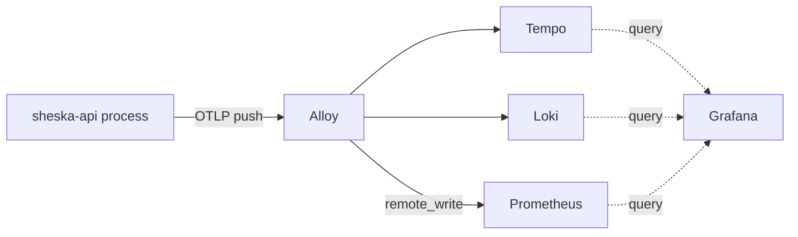

# API 옵저버빌리티 컨벤션

## 적용 범위

- 이 앱은 trace, log, metric을 OTLP로 공용 Alloy 배포에 전송한다.
- 이 문서는 telemetry 전송, 활성화, 리소스 속성, 소유 경계를 다룬다.
- 무엇을 어떤 레벨로 기록할지는 [API 로깅 정책](./logging.md)을 따른다.
  - 로깅 정책은 로그 내용과 심각도를, 이 문서는 전송과 상관관계를 규정한다.

## 파이프라인

- 계측하는 모든 환경에서 세 신호는 같은 push 경로를 사용한다.
  - 로컬 전용 pull 방식 대체 경로는 두지 않는다.

- metric은 `ServiceMonitor`가 수집하도록 노출하지 않고 push한다.
  - 클러스터의 수집기는 VPN을 통해 로컬 개발 프로세스에 접근할 수 없다.
  - 한 가지 전송 방식을 사용하면 운영과 개발의 코드 경로를 같게 유지할 수 있다.
- `OTEL_EXPORTER_OTLP_ENDPOINT`로 Alloy 주소를 선택한다.
  - 운영 환경은 클러스터 내부 DNS 주소를 사용한다.
  - 로컬 개발은 같은 Alloy 배포의 VPN 노출 주소를 사용한다.

## 소유 경계

- 이 저장소는 애플리케이션 계측, OTel 설정 파싱, 리소스 속성을 소유한다.
- 별도 `hash-infra` 저장소는 Alloy, telemetry backend, dashboard, endpoint 가용성을 소유한다.
- 모든 신호에 다음 리소스 속성을 붙인다.
  - `service.name`: 하드코딩한 `SERVICE_NAME` 상수.
  - `service.version`: 실행 중인 package의 `npm_package_version`.
  - `deployment.environment.name`: 하나의 backend를 공유하는 telemetry를 구분하는 `NODE_ENV`.
- 리소스 속성을 추가해도 Loki나 Prometheus에서 조회 가능한 label이 되지는 않는다.
  - label 승격에는 `hash-infra`의 명시적인 Alloy 설정 변경이 필요하다.
- metric에 `resource_to_telemetry_conversion`을 사용한 일괄 리소스-label 승격을 활성화하지 않는다.
  - 이 설정은 `process.pid`처럼 카디널리티가 높은 속성도 승격한다.
  - 그러면 프로세스를 재시작할 때마다 유지되는 Prometheus 시계열이 추가될 수 있다.

## 환경 정책

- 다음 조건을 모두 충족할 때만 SDK를 시작한다.
  - `NODE_ENV`가 `production` 또는 `development`다.
  - `OTEL_EXPORTER_OTLP_ENDPOINT`가 있고 유효한 URL이다.
- `NODE_ENV`가 없거나 허용 목록에 없으면 telemetry를 비활성화한다.
  - 계측할 환경을 추가할 때 허용 목록을 명시적으로 확장한다.
- 환경에 따라 달라지는 OTel 전송 값은 OTLP endpoint만 둔다.
- service name은 `.env.*` 파일이나 Helm values가 아니라 코드에 둔다.
  - service name은 애플리케이션 식별자이며 배포마다 달라지지 않는다.

## 부트스트랩

- OTel bootstrap은 반드시 `main.ts`의 첫 번째 import로 유지한다.
  - Auto-instrumentation은 `http`, `express`, `pg`, `ioredis` 같은 모듈을 로드할 때 patch한다.
  - 이런 모듈을 먼저 로드하면 해당 모듈에 계측을 적용할 수 없다.
- bootstrap을 NestJS provider나 module로 만들면 안 된다.
  - NestJS bootstrap과 일반 [런타임 배선](../architecture/runtime-wiring.md)보다 먼저 실행해야 한다.
- bootstrap은 설정을 파싱하기 전에 `dotenv`로 `.env.${NODE_ENV}`를 직접 로드한다.
  - 이 로직을 `ConfigService`로 바꾸지 않는다. 아직 `AppModule`과 typed application config가 없기 때문이다.
- processor가 대기 중인 telemetry를 내보낼 수 있도록 `SIGTERM`에서 SDK를 종료한다.

## 로깅 통합

- trace 상관관계를 위한 커스텀 pino `mixin`을 추가하지 않는다.
  - SDK가 실행되면 `@opentelemetry/instrumentation-pino`가 이미 `trace_id`와 `span_id`를 주입한다.
- OTel log 전송을 위한 두 번째 pino transport를 추가하지 않는다.
  - 같은 instrumentation이 이미 pino record를 OTel logs 파이프라인으로 전달한다.
  - 두 번째 통합을 추가하면 record와 logger 설정이 중복된다.
