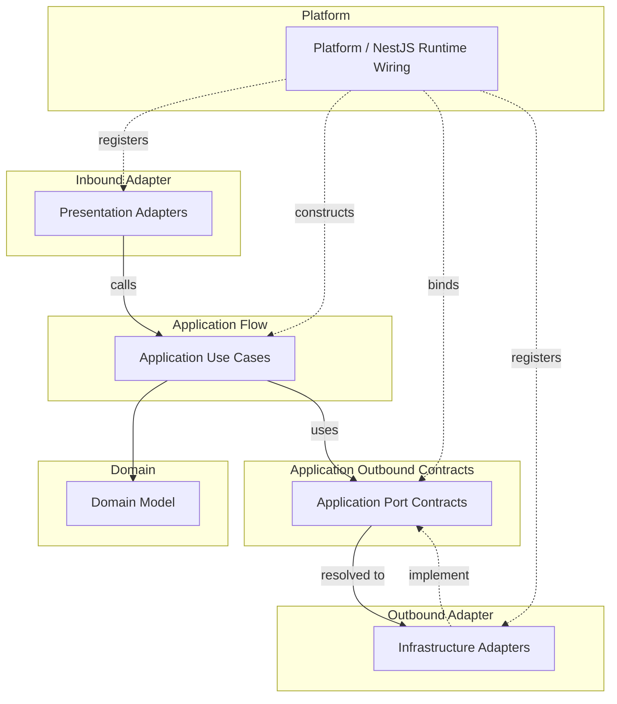

# API Runtime Wiring 컨벤션

Runtime wiring rule은 object가 어디서 생성되고 implementation이 port에 어떻게 연결되는지 판단한다.
Runtime wiring은 source dependency rule을 약화해서는 안 된다.

## 적용 범위

- Object creation, provider binding, port implementation registration, NestJS DI usage, runtime configuration ownership을 결정할 때 이 문서를 사용한다.
- Source file이 다른 source file을 import할 수 있는지 판단할 때는 source dependency convention을 사용한다.

## Runtime Model

### Runtime Flow And Wiring Map

이 map은 source import가 아니라 runtime flow와 provider binding을 보여준다.
실선 arrow는 runtime call/use direction을 나타낸다.
점선 arrow는 provider registration, binding, implementation을 나타낸다.

## Platform

- `src/main.ts`는 얇은 process entrypoint로 유지한다.
- `platform`은 application startup과 runtime wiring code를 담는다.
- NestJS root module, startup function, runtime config loading, global filter, interceptor, guard, pipe, app-level provider wiring에는 `platform/nest`를 사용한다.
- `platform`은 bounded context, adapter, kernels, `core`, framework, external runtime library에 의존할 수 있다.
- `platform`은 business rule을 담아서는 안 된다.
- `src/main.ts`의 얇은 entrypoint를 제외하고, `platform` 밖의 production code는 `platform`을 import해서는 안 된다.

## Environment Configuration

- Environment variable definition은 그 값을 사용하는 boundary에 속한다.
- Local API runtime value는 commit하면 안 되는 `apps/api/.env`에 둔다.
- `NODE_ENV`는 Node runtime mode를 설명한다.
- `APP_ENV`는 API app environment를 선택한다.
- Runtime selector의 허용 값과 default는 그 값을 소유하는 typed config schema 또는 mapper에 둔다.
- Environment variable owner는 schema, default, typed config mapper, owner-specific validation rule을 정의하는 것이 좋다.
- `platform`은 app-level과 selection-level environment schema를 aggregate하고 process startup에서 API runtime validation을 실행한다.
- Adapter-specific required environment variable은 selected adapter가 typed config를 만들 때 검증하는 것이 좋다.
- Conditional module registration처럼 raw `process.env`를 검사해야 하는 runtime wiring은 string comparison을 중복하기보다 owner-provided selector helper를 호출하는 것이 좋다.
- Production code는 `process.env`를 직접 읽기보다 validation 이후 typed config provider 또는 `ConfigService` value를 소비하는 것이 좋다.

## NestJS DI

- NestJS DI는 `platform/nest`, presentation adapter, infrastructure adapter, application use case 또는 service에서 실용적인 runtime wiring으로 사용할 수 있다.
- NestJS DI 때문에 domain code에서 NestJS로 source dependency가 생기면 안 된다.
- Application use case와 service는 constructor injection을 위해 `@Injectable()`, `@Inject()`, provider token 같은 좁은 DI metadata를 사용할 수 있다.
- Provider registration과 module composition은 application code 곳곳에 흩뜨리지 말고 `platform/nest` 또는 bounded context root module에 둔다.
- Application use case는 explicit dependency로 생성되는 plain TypeScript class로도 instantiation 가능하게 유지하는 것이 좋다.
- Use case behavior를 NestJS request object, module reference, container lookup, lifecycle callback 또는 다른 framework runtime API에 의존하게 만들지 않는다.
- Bounded context root module은 해당 context의 application, presentation, infrastructure provider를 조립할 수 있다.
- NestJS provider는 use case folder마다 module을 복제하기보다 bounded context 또는 runtime boundary 단위로 조립하는 것을 선호한다.

## Port Binding

- 이 convention에서 `port`는 기본적으로 application-owned boundary contract를 뜻한다.
- Port는 단순히 모든 interface, error type, DTO, mapper, shared contract를 뜻하지 않는다.
- `port`는 architecture 용어와 directory 개념으로 사용하되, contract type name에는 `Port` suffix를 붙이지 않는다. Contract는 그것이 나타내는 capability 기준으로 이름 붙인다.
- Runtime wiring은 inner source file이 outer implementation을 import하지 않게 유지하면서 outer implementation을 inner port에 연결할 수 있다.
- Infrastructure adapter는 application port를 구현할 수 있다.
- `platform` 또는 adapter wiring은 각 port를 만족하는 implementation을 등록한다.
- Runtime wiring을 이유로 domain 또는 application core에 금지된 import를 추가하면 안 된다.

## Non-Port Contracts

- Presentation DTO와 mapper는 protocol adapter contract이지 port가 아니다.
- Presentation error response envelope는 protocol adapter contract이지 port가 아니다.
- Infrastructure exception과 persistence mapper는 adapter concern이지 port가 아니다.
- Outer layer contract를 application core가 소비해야 한다면, 그 contract를 안쪽으로 옮겨 application port 또는 application-kernel contract로 모델링한다.
