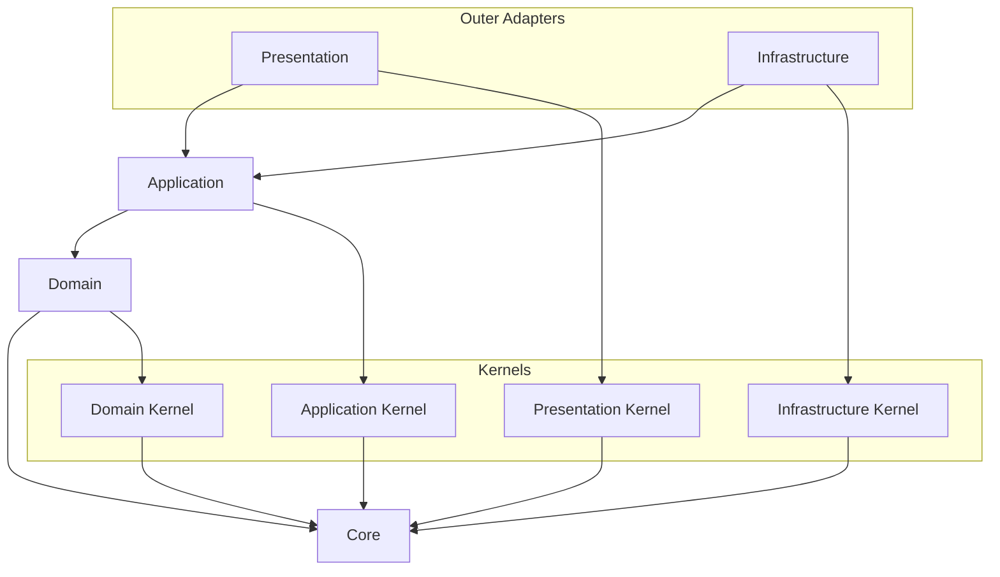

# API Source Dependency 컨벤션

Source dependency rule은 source file이 무엇을 import할 수 있는지 판단한다.
Dependency direction은 outer layer에서 inner layer로 향하는 방향을 일관되게 유지해야 한다.

## Visual Dependency Map

모든 arrow는 "source가 target을 import할 수 있다"는 뜻으로 읽는다.
이 문서에 dependency가 표시되어 있지 않고 명시적으로 허용되어 있지도 않다면 기본적으로 금지된 것으로 본다.



Primary source direction은 다음과 같다:

```text
presentation -> application -> domain -> core
infrastructure -> application -> domain -> core
```

## 금지된 Shortcut

```text
domain -/-> application
domain -/-> infrastructure
domain -/-> presentation
domain -/-> platform
application core -/-> infrastructure implementations
application core -/-> presentation DTOs
application core -/-> framework decorators
application core -/-> framework DI APIs
application core -/-> platform concrete types
```

## Source Direction

- `core`는 어떤 project layer에도 의존하지 않는다.
- Kernel directory는 `core`에 의존할 수 있다.
- `domain`은 `core`와 `kernels/domain`에 의존할 수 있다.
- `application`은 `core`, `domain`, `kernels/application`에 의존할 수 있다.
- `infrastructure`는 adapter 구현 시 `core`, `domain`, `application`, `kernels/infrastructure`, external library에 의존할 수 있다.
- `presentation`은 external protocol 처리 시 `core`, `application`, `kernels/presentation`, framework library에 의존할 수 있다.
- Bounded context root wiring module은 feature를 조립하기 위해 해당 context의 application, presentation, infrastructure code에 의존할 수 있다.
- `src/main.ts`의 얇은 entrypoint를 제외하고, `platform` 밖의 production code는 `platform`을 import해서는 안 된다.
- Domain code는 `platform`, NestJS, database, HTTP, SDK, infrastructure, presentation, application code를 import해서는 안 된다.
- Application core는 infrastructure implementation, presentation DTO, framework decorator, framework DI API, platform concrete type을 import해서는 안 된다.

## Import Path 정책

- Project path alias는 [`apps/api/tsconfig.json`](../../tsconfig.json)에만 선언한다.
- TypeScript, Vitest, static analysis tool은 project alias 의미를 재정의하지 말고 `tsconfig.json`을 사용하는 것이 좋다.
- Path alias는 일반적인 path-shortening convenience가 아니라 stable architectural boundary를 표현한다.
- Alias는 `@core/*`, `@kernels/*`, `@contexts/*`, `@platform/*` 같은 named source boundary로 제한한다.
- `@api/*`, `@src/*`, `@/*` 같은 broad alias는 추가하지 않는다.
- Source boundary alias가 존재한다면 production `src` import는 해당 boundary를 넘을 때 그 alias를 사용하는 것이 좋다.
- 같은 local implementation area 내부에서는 relative import를 선호한다.
- `index.ts` file은 기본 folder decoration이 아니라 의도적으로 export하는 contract의 public surface로 사용한다.
- Cross-boundary import는 public surface가 있으면 그 public surface를 대상으로 하는 것이 좋다.
- Kernel directory, context domain code, application port로 들어가는 production import는 해당 public surface를 사용하는 것이 좋다.
- 다른 context 또는 layer internal로 들어가는 deep import는 이 문서가 해당 dependency를 명시적으로 허용하지 않는 한 피한다.

## Core

- `core`는 layer, framework, bounded context, business vocabulary가 없는 pure primitive를 담는다.
- 예시는 `Result`, `Option`, `BaseError`, `assertNever`, generic guard를 포함한다.
- 모든 layer는 `core`에 의존할 수 있다.
- `core`는 project layer, framework, external SDK, business concept에 의존해서는 안 된다.

## Domain Layer

- Domain layer는 business rule과 domain model을 담는다.
- Entity, value object, aggregate, domain service, domain event, domain error에 사용한다.
- Domain code는 application, infrastructure, presentation, framework, database, HTTP, SDK detail을 알면 안 된다.
- Domain code는 pure business behavior와 invariant를 표현하는 것이 좋다.
- Domain code는 `core`와 `kernels/domain`에 의존할 수 있다.

## Application Layer

- Application layer는 use case와 application flow를 표현한다.
- Command, query, use case handler, application service, application-owned port interface, transaction boundary, application error에 사용한다.
- Application core는 use case flow와 contract를 뜻하며 NestJS module 또는 provider registration을 뜻하지 않는다.
- Application code는 domain model을 사용해 user intent를 실행한다.
- Application code는 infrastructure implementation detail을 알면 안 된다.
- Application code는 presentation request 또는 response DTO shape를 알면 안 된다.
- Application core는 framework decorator 또는 framework DI API에 의존해서는 안 된다.
- Application use case wiring용 NestJS module file은 필요할 때 `contexts/{context-name}/application` 아래가 아니라 bounded context root에 둔다.
- Application code는 domain error와 port error를 application 또는 use case error로 변환할 수 있다.
- Application core는 `core`, domain code, `kernels/application`에 의존할 수 있다.

## Infrastructure Layer

- Infrastructure layer는 technical adapter를 구현한다.
- Database, ORM, external API, file system, message broker, SDK, persistence code에 사용한다.
- Infrastructure code는 application-owned port 또는 domain/application contract를 구현한다.
- Adapter code는 Prisma, TypeORM, HTTP client, SDK, Drizzle error 같은 technology-specific error를 port 또는 infrastructure error로 변환한다.
- Infrastructure code는 framework와 external library에 의존할 수 있다.
- Infrastructure code는 presentation code를 알 필요가 없다.

## Presentation Layer

- Presentation layer는 external request와 response의 entry point다.
- Controller, resolver, request DTO, response DTO, protocol mapper, HTTP error mapper에 사용한다.
- Presentation code는 application use case를 호출한다.
- Presentation code는 application error를 protocol response로 변환하고 masking policy를 적용한다.
- Presentation code는 domain 또는 infrastructure error를 client에 직접 노출하지 않는 것이 좋다.
- Presentation code는 framework와 protocol library에 의존할 수 있다.

## Kernel Directory

- `kernels/domain`은 domain-layer 공통 policy와 여러 bounded context가 의도적으로 공유하는 stable domain concept를 담는다.
- `kernels/application`은 application-layer 공통 contract만 담는다.
- `kernels/infrastructure`는 infrastructure 공통 adapter policy만 담는다.
- `kernels/presentation`은 presentation-layer 공통 policy만 담는다.
- Kernel directory는 `core`에 의존할 수 있다.
- Kernel directory는 bounded context, platform code, framework code, outer layer에 의존해서는 안 된다.
- Kernel directory는 generic utility bucket이 되어서는 안 된다.
- Feature-specific policy는 소유 bounded context 내부에 둔다.
