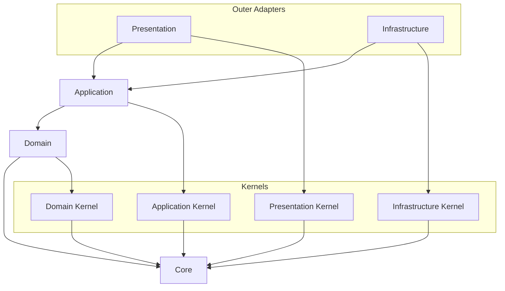

# API Source Dependency 컨벤션

Source dependency rule은 source file이 무엇을 import할 수 있는지 판단한다.
Dependency direction은 outer layer에서 inner layer로 향하는 방향을 일관되게 유지해야 한다.

## 적용 범위

- Import direction, source layer ownership, project path alias, public surface를 결정할 때 이 문서를 사용한다.
- 구현체가 runtime에서 어떻게 생성되거나 연결되는지 판단할 때는 runtime wiring convention을 사용한다.

## Dependency Direction

### Visual Dependency Map

모든 arrow는 "source가 target을 import할 수 있다"는 뜻으로 읽는다.
이 문서에 dependency가 표시되어 있지 않고 명시적으로 허용되어 있지도 않다면 기본적으로 금지된 것으로 본다.



Primary source direction은 다음과 같다:

```text
presentation -> application -> domain -> core
infrastructure -> application -> domain -> core
```

### Source Direction

Source dependency는 각 source area가 import할 수 있는 boundary와 import하면 안 되는 boundary를 기준으로 판단한다.

| Source area | May import | Must not import |
| --- | --- | --- |
| `core` | 없음 | project layer, framework, external SDK, business concept |
| `kernels` | `core` | bounded context implementation, `platform`, framework code, outer layer |
| `domain` | `core`, `kernels/domain` | `application`, `infrastructure`, `presentation`, `platform`, NestJS, database, HTTP, SDK |
| `application` | `core`, `domain`, `kernels/application` | infrastructure implementation, presentation DTO, framework decorator, framework DI API, platform concrete type |
| `infrastructure` | Adapter 구현 시 `core`, `domain`, `application`, `kernels/infrastructure`, framework 또는 external library | `presentation`, `platform` startup code |
| `presentation` | External protocol 처리 시 `core`, `application`, `kernels/presentation`, framework 또는 protocol library | infrastructure implementation, database adapter, SDK adapter |
| Bounded context root wiring module | Feature 조립을 위해 해당 context의 application, presentation, infrastructure code | 다른 context의 내부 구현을 임의로 조립하지 않는다 |

`platform`은 runtime startup과 module wiring에 필요한 bounded context, adapter, framework code를 import할 수 있다.
`src/main.ts`의 얇은 entrypoint를 제외하고, `platform` 밖 production code는 `platform`을 import하지 않는다.

## Import Surface

### Import Path 정책

- Project path alias는 [`apps/api/tsconfig.json`](../../tsconfig.json)에만 선언한다.
- TypeScript, Vitest, static analysis tool은 project alias 의미를 재정의하지 말고 `tsconfig.json`을 사용하는 것이 좋다.
- Path alias는 일반적인 path-shortening convenience가 아니라 stable architectural boundary를 표현한다.
- Alias는 `@core/*`, `@kernels/*`, `@contexts/*`, `@platform/*` 같은 named source boundary로 제한한다.
- `@api/*`, `@src/*`, `@/*` 같은 broad alias는 추가하지 않는다.
- Source boundary alias가 존재한다면 production `src` import는 해당 boundary를 넘을 때 그 alias를 사용하는 것이 좋다.
- 같은 local implementation area 내부에서는 relative import를 선호한다.

### Public Surface 정책

- `index.ts` file은 JavaScript/TypeScript barrel file이며, 기본 folder decoration이 아니라 의도적으로 export하는 contract의 public surface로 사용한다.
- `index.ts` file을 기계적으로 만들거나 folder 내부의 모든 export를 그대로 다시 노출하지 않는다.
- Public surface에는 외부 source area가 실제로 import해야 하는 contract만 노출한다.
- 내부 구현, helper, adapter detail, test fixture, local-only type은 외부 계약이 아니라면 public surface에 노출하지 않는다.
- Cross-boundary import는 public surface가 있으면 그 public surface를 대상으로 하는 것이 좋다.
- Kernel directory, context domain code, application port로 들어가는 production import는 해당 public surface를 사용하는 것이 좋다.
- 다른 context 또는 layer internal로 들어가는 deep import는 이 문서가 해당 dependency를 명시적으로 허용하지 않는 한 피한다.

## Source Area

### Core

- `core`는 layer, framework, bounded context, business vocabulary가 없는 pure primitive를 담는다.
- 모든 layer는 `core`에 의존할 수 있다.

### Domain Layer

- Domain layer는 business rule과 domain model을 담는다.
- Entity, value object, aggregate, domain service, domain event, domain error에 사용한다.
- Domain code는 application, infrastructure, presentation, framework, database, HTTP, SDK detail을 알면 안 된다.
- Domain code는 pure business behavior와 invariant를 표현하는 것이 좋다.
- Domain code는 `core`와 `kernels/domain`에 의존할 수 있다.

### Application Layer

- Application layer는 use case와 application flow를 표현한다.
- Application code는 domain model을 사용해 user intent를 실행한다.
- Application code는 infrastructure implementation detail을 알면 안 된다.
- Application code는 presentation request 또는 response DTO shape를 알면 안 된다.
- Application core는 framework decorator 또는 framework DI API에 의존해서는 안 된다.
- Application code는 같은 context의 domain error를 기본적으로 그대로 전파하는 것이 좋다.
- Application이 소유한 port error가 호출자가 다룰 수 있는 계약이라면, application code는 port failure를 그대로 전파하는 것이 좋다.
- Application code는 구별되는 orchestration 또는 caller-facing meaning을 의도적으로 추가할 때 application-owned port failure를 application 또는 use case error로 변환할 수 있다.
- Application core는 `core`, domain code, `kernels/application`에 의존할 수 있다.

### Infrastructure Layer

- Infrastructure layer는 technical adapter를 구현한다.
- Database, ORM, external API, file system, message broker, SDK, persistence code에 사용한다.
- Infrastructure code는 application-owned port 또는 domain/application contract를 구현한다.
- Adapter code는 HTTP client, SDK, Drizzle error 같은 technology-specific error를 port 또는 infrastructure error로 변환한다.
- Infrastructure code는 framework와 external library에 의존할 수 있다.

### Presentation Layer

- Presentation layer는 external request와 response의 entry point다.
- Controller, resolver, request DTO, response DTO, protocol mapper, HTTP error mapper에 사용한다.
- Presentation code는 application use case를 호출한다.
- Presentation code는 application error를 protocol response로 변환하고 masking policy를 적용한다.
- Presentation code는 domain 또는 infrastructure error를 client에 직접 노출하지 않는 것이 좋다.
- Presentation code는 framework와 protocol library에 의존할 수 있다.

### Kernel Directory

- `kernels/domain`은 domain-layer 공통 policy와 여러 bounded context가 의도적으로 공유하는 stable domain concept를 담는다.
- `kernels/application`은 application-layer 공통 contract만 담는다.
- `kernels/infrastructure`는 infrastructure 공통 adapter policy만 담는다.
- `kernels/presentation`은 presentation-layer 공통 policy만 담는다.
- Kernel directory는 `core`에 의존할 수 있다.
- Kernel directory는 bounded context, platform code, framework code, outer layer에 의존해서는 안 된다.
- Kernel directory는 generic utility bucket이 되어서는 안 된다.
- Feature-specific policy는 소유 bounded context 내부에 둔다.
